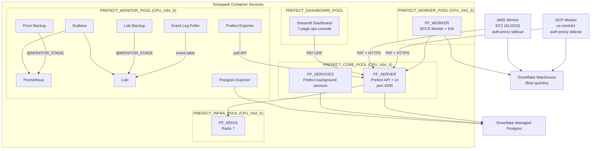

# Prefect 3.x on Snowpark Container Services (SPCS)

Production-grade, self-hosted Prefect orchestration server running entirely on SPCS with hybrid worker support for multi-cloud execution.

## Architecture

```
                     +------------------+
                     |   Prefect UI     |
                     |  (port 4200)     |
                     +--------+---------+
                              |
     +------------------------+------------------------+
     |                        |                        |
+----v-----------+  +---------v-----------+  +---------v---------+
| Snowflake      |  | PF_SERVER           |  | PF_SERVICES       |
| Managed        |  | prefect server      |  | prefect server    |
| Postgres       |  |   start             |  |   services start  |
| (PREFECT_PG)   |  |   --no-services     |  | PREFECT_CORE_POOL |
+----------------+  | PREFECT_CORE_POOL   |  +-------------------+
                    | public endpoint     |
+----------+       +---------+-----------+
| PF_REDIS |                 |
| redis:7  |        +--------+--------+---------+
| INFRA    |        |                 |         |
+----------+        v                 v         v
            +-------+-------+  +------+------+  +------+------+
            | PF_WORKER     |  | GCP Worker  |  | AWS Worker  |
            | SPCS (EAI)    |  | External VM |  | EC2 (AL2023)|
            | spcs-pool     |  | gcp-pool    |  | aws-pool    |
            | git_clone +   |  | git_clone   |  | git_clone   |
            | stage fallback|  +-------------+  +-------------+
            +---------------+
```

**5–6 SPCS services** (6 on GCP with containerized Postgres) + **Snowflake Managed Postgres** (AWS/Azure) across **3–4 compute pools**, with hybrid workers on GCP, AWS, and Azure.

<details>
<summary>Mermaid Architecture Diagram (click to expand)</summary>



</details>

## Quick Start

### Local Development

```bash
# 1. Start the local Prefect stack
docker compose up -d

# 2. Open the UI
open http://localhost:4200

# 3. Deploy flows to the local server (must run from flows/ directory)
cd flows && PREFECT_API_URL=http://localhost:4200/api \
  uv run --project .. prefect deploy --all --prefect-file ../prefect.yaml
cd ..

# 4. Tear down
docker compose down -v
```

### SPCS Deployment

```bash
# 1. Build and push container images
./scripts/build_and_push.sh --connection my_connection

# 2. Copy secrets template and fill in passwords
cp sql/03_setup_secrets.sql.template sql/03_setup_secrets.sql
# Edit sql/03_setup_secrets.sql with your passwords

# 3. Deploy all infrastructure
./scripts/deploy.sh --connection my_connection

# 4. Get the server endpoint
snow sql -q "SHOW ENDPOINTS IN SERVICE PREFECT_DB.PREFECT_SCHEMA.PF_SERVER" --connection my_connection

# 5. Deploy flows to SPCS via auth-proxy (bypasses SPCS auth gate CSRF issue)
make auth-proxy       # starts nginx proxy on localhost:4202
make deploy-prefect   # deploys all flows through the proxy

# 6. Upload flow files to the stage (no worker restart needed!)
./scripts/sync_flows.sh
```

### Updating Existing Services

After the initial deployment, use `--update` to apply changes (image updates, spec
changes, env vars, resource adjustments) without regenerating the public endpoint URL:

```bash
# Update specs and ALTER SERVICE (preserves endpoint URL)
./scripts/deploy.sh --connection my_connection --update
```

> **WARNING:** Do NOT use `CREATE OR REPLACE SERVICE` — it drops and recreates the
> service, generating a new ingress URL that breaks PAT tokens, auth proxies, and
> GCP worker configurations. Always use `ALTER SERVICE` via `deploy.sh --update` or
> `update_versions.sh --apply`.

### Multi-Cloud SPCS Deployment

This project is validated across **AWS**, **Azure**, and **GCP** Snowflake accounts. The core setup (SQL 01–06, build, deploy) is identical; differences are noted below.

| | AWS | Azure | GCP |
|---|---|---|---|
| **Postgres** | Snowflake Managed Postgres | Snowflake Managed Postgres | Containerized `postgres:16` (PF_POSTGRES service) |
| **Services SQL** | `07_create_services.sql` | `07_create_services.sql` | `07_create_services_gcp.sql` |
| **PG EAI needed** | Yes (for PF_SERVER, PF_MONITOR) | Yes | No (internal DNS `pf-postgres`) |
| **Extra secrets** | — | — | `PREFECT_PG_PASSWORD` (just password) |
| **Extra compute pool** | — | — | `PREFECT_INFRA_POOL` for PF_REDIS + PF_POSTGRES |
| **Total services** | 5 + PF_MONITOR | 5 + PF_MONITOR | 6 + PF_MONITOR |

**GCP-specific notes:**

- GCP needs **two** Postgres-related secrets with different formats:
  - `PREFECT_PG_PASSWORD` = plain password (used by `pf_postgres.yaml` as `POSTGRES_PASSWORD` env var)
  - `PREFECT_DB_PASSWORD` = full SQLAlchemy URL `postgresql+asyncpg://prefect:<pw>@pf-postgres:5432/prefect` (used by `pf_migrate.yaml` → `PREFECT_API_DATABASE_CONNECTION_URL`)
- PF_REDIS and PF_POSTGRES run on `PREFECT_INFRA_POOL`, not `PREFECT_CORE_POOL`
- No SSL needed for internal Postgres (`sslmode=disable`)
- The `postgres:16` image must be pushed to the registry (included in `build_and_push.sh`)

**Azure-specific notes:**

- Compute pools take ~20 minutes to provision from cold (vs ~5 min on AWS/GCP)
- Azure Managed Postgres instances **persist through Snowflake DB drop/recreate** — re-attach the network policy after recreating

**Deployment order for a fresh setup (any cloud):**

```bash
# 1. Infrastructure (SQL 01–06)
snow sql -f sql/01_setup_database.sql --connection <conn>
snow sql -f sql/02_setup_stages.sql --connection <conn>
# Fill in sql/03_setup_secrets.sql from template, then:
snow sql -f sql/03_setup_secrets.sql --connection <conn>
snow sql -f sql/04_setup_networking.sql --connection <conn>
snow sql -f sql/05_setup_compute_pools.sql --connection <conn>
snow sql -f sql/06_setup_image_repo.sql --connection <conn>

# 2. Build and push images
./scripts/build_and_push.sh --connection <conn>

# 3. Upload specs + flows
./scripts/deploy.sh --connection <conn>
./scripts/sync_flows.sh --connection <conn>

# 4. Deploy monitoring
./monitoring/deploy_monitoring.sh --connection <conn>

# 5. GCP only: use 07_create_services_gcp.sql instead of 07_create_services.sql
```

**Known gotchas:**

- `EXECUTE JOB SERVICE` does **not** support `EXTERNAL_ACCESS_INTEGRATIONS` — use `CREATE SERVICE` with `MIN_INSTANCES=1` for one-shot tasks needing EAI
- Do **not** upload `ds-local.yaml` to `MONITOR_STAGE` — both it and `ds.yaml` set `isDefault: true` on the Prometheus datasource, crashing Grafana
- `pools.yaml` must be on the `PREFECT_FLOWS` stage for the deploy job to find it
- `build_and_push.sh` builds all required images including `postgres:16`, `redis_exporter`, and `prefect-exporter:v3-status`

**Monitoring gotchas:**

- **postgres-exporter PG17 compatibility:** PG17 moved checkpoint columns from `pg_stat_bgwriter` to `pg_stat_checkpointer`. postgres-exporter < v0.17.0 queries the removed columns and floods logs with `ERROR: column "checkpoints_timed" does not exist`. Use v0.17.0+ (v0.19.1 recommended).
- **Grafana legacy vs unified alerting:** Grafana 11+ removed legacy alerting. Having both `GF_ALERTING_ENABLED=true` and `GF_UNIFIED_ALERTING_ENABLED=true` causes startup conflicts. Set `GF_ALERTING_ENABLED=false` explicitly.
- **Loki alertmanager_url disabled:** Grafana's unified alerting Alertmanager API returns `400 Bad Request` for Loki-generated alerts. Set `alertmanager_url: ""` in `loki-config.yaml`. Loki's ruler still evaluates rules locally; Grafana queries alert state via the ruler API (`/loki/api/v1/rules`).
- **Loki ruler `alertmanager_client` YAML structure:** The `NotifierConfig` Go struct uses `yaml:",inline"` for `BasicAuth`, meaning fields must be flat (`basic_auth_username`, `basic_auth_password`) at the `alertmanager_client` level — NOT nested as `basic_auth.username`.
- **SPCS volume mount caching:** When a container crashes repeatedly after a spec change, SPCS may keep using the cached volume mount from the original start. `snow spcs service upgrade` alone may not force a refresh. Use `ALTER SERVICE ... SUSPEND` then `ALTER SERVICE ... RESUME` to force a clean restart with fresh volume mounts.

### Hybrid Worker (GCP)

```bash
# Set required environment variables (use PREFECT_SVC service user)
export SNOWFLAKE_PAT="<role-restricted-pat-for-PREFECT_SVC>"
export SPCS_ENDPOINT="<spcs-public-endpoint-hostname>"
export GIT_ACCESS_TOKEN="<git-access-token>"  # GitHub (ghp_), GitLab (glpat-), BitBucket, etc.
export GIT_REPO_URL="https://github.com/myorg/myrepo.git"  # HTTPS URL of your git repo
export GIT_BRANCH="main"                     # Branch to clone (default: main)
export SNOWFLAKE_ACCOUNT="<org-account>"
export SNOWFLAKE_USER="PREFECT_SVC"

# Start the auth-proxy + worker stack
docker compose -f workers/gcp/docker-compose.gcp.yaml up -d
```

### Hybrid Worker (AWS)

```bash
# Set required environment variables (same as GCP — identical auth pattern)
export SNOWFLAKE_PAT="<role-restricted-pat-for-PREFECT_SVC>"
export SPCS_ENDPOINT="<spcs-public-endpoint-hostname>"
export GIT_ACCESS_TOKEN="<git-access-token>"
export GIT_REPO_URL="https://github.com/myorg/myrepo.git"
export GIT_BRANCH="main"
export SNOWFLAKE_ACCOUNT="<org-account>"
export SNOWFLAKE_USER="PREFECT_SVC"

# Option A: Start locally with Docker Compose
docker compose -f workers/aws/docker-compose.aws.yaml --env-file .env up -d

# Option B: Launch on EC2 (headless — no SSH needed, uses SSM for debug)
bash workers/aws/setup_aws_worker.sh
```

Both GCP and AWS workers use the same **nginx auth-proxy sidecar** pattern — the proxy
injects the Snowflake PAT into every request to the SPCS endpoint. Flow code is delivered
via Prefect's `git_clone` pull step. The only difference between cloud providers is the
DNS resolver in `nginx.conf` (GCP: `8.8.8.8`, AWS VPC: `169.254.169.253`).
See [Hybrid Worker Architecture](#hybrid-worker-architecture) below and
[workers/aws/README.md](workers/aws/README.md) for a step-by-step guide to adding new AWS workers.

### Hybrid Worker (Azure)

```bash
# Set required environment variables (same pattern as GCP/AWS)
export SNOWFLAKE_PAT="<role-restricted-pat-for-PREFECT_SVC>"
export SPCS_ENDPOINT="<spcs-public-endpoint-hostname>"
export GIT_ACCESS_TOKEN="<git-access-token>"
export GIT_REPO_URL="https://github.com/myorg/myrepo.git"
export GIT_BRANCH="main"
export SNOWFLAKE_ACCOUNT="<org-account>"
export SNOWFLAKE_USER="PREFECT_SVC"

# Start the auth-proxy + worker stack
docker compose -f workers/azure/docker-compose.azure.yaml --env-file .env up -d
```

Uses the same **nginx auth-proxy sidecar** pattern as GCP and AWS. The auth-proxy
listens on port **4204** (GCP: 4201, AWS: 4202). The `Dockerfile.worker` is symlinked
from the AWS directory — all three clouds share the same worker image. The DNS resolver
in `nginx.conf` uses Azure's default (`168.63.129.16`).

> **Note:** Azure VMs in Snowflake SE demo accounts may have restricted permissions.
> If you cannot provision a VM, run the worker stack on any machine with Docker access
> (e.g., a GCP VM or local workstation) — the auth-proxy handles SPCS authentication
> regardless of where it runs.

### Local Auth-Proxy (CSRF Fix)

The SPCS auth gate intercepts unauthenticated requests and returns HTML redirects.
Prefect's CSRF preflight (`GET /api/csrf-token`) sends no auth headers, so it gets
HTML instead of JSON, causing `JSONDecodeError`. The local auth-proxy solves this
by injecting the Snowflake PAT into every request — the same pattern used by
GCP/AWS workers.

```
Your machine                     SPCS
┌──────────────┐  ┌───────────┐  ┌──────────────┐
│ prefect       │─►│ nginx     │─►│ SPCS auth    │
│ deploy --all  │  │ :4202     │  │ gate         │
│               │  │           │  │              │
│ (no auth      │  │ injects:  │  │ sees valid   │
│  headers)     │  │ Snowflake │  │ token →      │
│               │  │ Token=PAT │  │ passes thru  │
└──────────────┘  └───────────┘  └──────────────┘
```

The nginx container reuses `workers/gcp/nginx.conf` (no config duplication), reads
`SNOWFLAKE_PAT` and `SPCS_ENDPOINT` from `.env`, and uses ~5MB RAM. Leave it running
or stop it when done.

```bash
# Start the local auth-proxy (reads SNOWFLAKE_PAT and SPCS_ENDPOINT from .env)
make auth-proxy

# Now any Prefect CLI command works against SPCS:
export PREFECT_API_URL=http://localhost:4202/api
cd flows && uv run prefect deploy --all --prefect-file ../prefect.yaml

# Or use the combined target:
make deploy-prefect   # auto-starts proxy + deploys all flows

# Stop when done:
make auth-proxy-down
```

Port mapping: `4200` = local dev server, `4201` = GCP worker proxy, `4202` = local auth-proxy.

## Project Structure

```
prefect-spcs/
├── .gitlab-ci.yml              # CI/CD pipeline (lint → test → diff → build → deploy)
├── .pre-commit-config.yaml     # Pre-commit hooks (ruff, shellcheck, detect-secrets)
├── .env.example                # Environment variable template
├── pyproject.toml              # Python project config + dependency groups (dev, dashboard)
├── docker-compose.yaml         # Local development stack (6 services)
├── docker-compose.auth-proxy.yaml  # Local auth-proxy for SPCS (CSRF bypass)
├── prefect.yaml                # Declarative deployment config (prefect deploy --all)
├── pools.yaml                  # Work pool configuration (source of truth for 5 pools)
├── CONSTITUTION.md             # Governing principles (spec-kit)
├── SPECIFICATION.md            # Formal specification (spec-kit)
├── flows/                      # Prefect flow code
│   ├── example_flow.py         # Hello world
│   ├── snowflake_flow.py       # Query Snowflake (hardcoded demo query, 3-tier auth)
│   ├── external_api_flow.py    # External API (EAI demo, SSRF-protected allowlist)
│   ├── e2e_test_flow.py        # End-to-end pipeline test
│   ├── data_quality_flow.py    # Daily data quality checks on Snowflake tables
│   ├── stage_cleanup_flow.py   # Stage file retention cleanup
│   ├── health_check_flow.py    # Infrastructure health check (Snowflake, SPCS, pools)
│   ├── shared_utils.py         # Root-level shared module (importable by all flows)
│   ├── hooks.py                # Slack + webhook failure/completion notifications (opt-in)
│   ├── deploy.py               # Offline validation (--validate) and legacy deployment
│   └── analytics/              # Sub-package with nested flows
│       ├── __init__.py
│       ├── sf_helpers.py       # Shared Snowflake connection helpers (3-tier auth)
│       ├── revenue_flow.py     # Multi-file subfolder flow (sibling imports)
│       └── reports/            # Deep nested sub-package
│           ├── __init__.py
│           ├── formatters.py   # Sibling helper module (format_currency, etc.)
│           └── quarterly_flow.py  # Deep nested import stress test (3 import patterns)
├── specs/                      # SPCS service specifications
│   ├── pf_postgres.yaml        # Containerized Postgres (GCP only)
│   ├── pf_redis.yaml
│   ├── pf_server.yaml
│   ├── pf_services.yaml
│   ├── pf_worker.yaml          # git_clone + stage volume v2 fallback
│   ├── pf_migrate.yaml
│   ├── pf_deploy_job.yaml      # Register deployments (DEPLOY_FLAGS env var for GCP)
│   └── pf_trigger_job.yaml     # Trigger a flow run
├── sql/                        # Snowflake setup scripts (run in order)
│   ├── 01_setup_database.sql
│   ├── 02_setup_stages.sql
│   ├── 03_setup_secrets.sql.template
│   ├── 04_setup_networking.sql # EAI for worker egress
│   ├── 05_setup_compute_pools.sql
│   ├── 06_setup_image_repo.sql
│   ├── 07_create_services.sql  # AWS/Azure (Managed Postgres)
│   ├── 07_create_services_gcp.sql # GCP variant (containerized Postgres)
│   ├── 07b_update_services.sql # ALTER SERVICE for rolling upgrades
│   ├── 08_validate.sql
│   ├── 09_suspend_all.sql
│   └── 10_resume_all.sql
├── scripts/                    # Automation scripts
│   ├── _lib.sh                 # Shared bash helpers (wait_for_ready, etc.)
│   ├── build_and_push.sh       # Build + push Docker images (--core-only, --monitoring-only)
│   ├── cost_analysis.sh        # SPCS cost breakdown and optimization recommendations
│   ├── deploy.sh               # Deploy SPCS (--update for ALTER SERVICE)
│   ├── deploy_flows.sh         # Register flow deployments
│   ├── load_test.sh            # End-to-end pipeline validation (flows, metrics, logs)
│   ├── rotate_secrets.sh       # Rotate Snowflake secrets + check PAT expiry
│   ├── setup_automations.py    # Prefect failure automations (idempotent, --dry-run)
│   ├── sync_flows.sh           # Upload flows to @PREFECT_FLOWS
│   ├── teardown.sh             # Remove all SPCS resources
│   ├── update_versions.sh      # Update image versions (--dry-run, --apply)
│   ├── demo.sh                 # End-to-end demo (9 sections, SPCS auth-aware)
│   └── schedule_pools.sh       # Create Snowflake tasks for pool suspend/resume
├── dashboard/                  # SPCS Observability Dashboard (Streamlit)
│   ├── app.py                  # 7-page dashboard: Overview, Compute Pools, Services,
│   │                           #   Work Pools & Workers, Flow Runs, Logs & Events, Resource Metrics
│   ├── pyproject.toml          # Dashboard dependencies
│   └── snowflake.yml           # SiS Container Runtime deployment config
├── monitoring/                 # Prometheus + Grafana + Loki observability stack
│   ├── deploy_monitoring.sh    # Deploy PF_MONITOR service to SPCS
│   ├── teardown_monitoring.sh  # Remove monitoring service
│   ├── docker-compose.monitoring.yml  # VM monitoring sidecars
│   ├── specs/
│   │   └── pf_monitor.yaml     # 8-container SPCS service (Prometheus, Grafana, Loki, postgres-exporter, prefect-exporter, event-log-poller, prom-backup, loki-backup)
│   ├── prometheus/
│   │   ├── prometheus.yml      # Scrape config for all Prefect services
│   │   └── rules/alerts.yml    # 7 alert rules
│   ├── grafana/
│   │   ├── dashboards/         # 9 dashboards (health, overview, workers, logs, alerts, postgres, prefect-app, redis, spcs-logs)
│   │   └── provisioning/       # Datasource + dashboard provisioning
│   ├── loki/
│   │   └── loki-config.yaml    # Loki log aggregation config
│   └── vm-agents/              # Sidecar configs for hybrid worker VMs
│       ├── prometheus-agent.yml    # Metrics push via remote_write
│       ├── promtail-config.yaml    # Log forwarding to Loki
│       └── nginx-monitor.conf      # Monitoring proxy
├── workers/                    # External hybrid workers
│   ├── gcp/                    # GCP worker
│   │   ├── Dockerfile.worker   # Worker image (symlink → ../aws/Dockerfile.worker)
│   │   ├── docker-compose.gcp.yaml # Auth-proxy + worker stack
│   │   ├── docker-compose.gcp-backup.yaml # Backup pool worker stack
│   │   ├── nginx.conf          # Reverse proxy template (PAT injection, resolver 8.8.8.8)
│   │   ├── setup_gcp_worker.sh # GCP VM provisioning script
│   │   └── README.md           # GCP worker setup guide
│   └── aws/                    # AWS worker
│       ├── Dockerfile.worker   # Worker image (shared by GCP via symlink)
│       ├── docker-compose.aws.yaml # Auth-proxy + worker stack
│       ├── docker-compose.aws-backup.yaml # Backup pool worker stack
│       ├── nginx.conf          # Reverse proxy template (resolver 169.254.169.253)
│       ├── setup_aws_worker.sh # EC2 provisioning (headless via user-data)
│       └── README.md           # Step-by-step guide to adding AWS workers
├── images/                     # Docker build contexts
│   ├── prefect/                # Custom worker image
│   ├── prefect-exporter/       # Prometheus metrics exporter for Prefect API
│   ├── postgres/               # postgres:16 wrapper (GCP only — AWS/Azure use Managed Postgres)
│   ├── redis/                  # redis:7 wrapper
│   └── spcs-log-poller/        # Polls SPCS system logs into Loki
└── tests/                      # Test suite (2300+ offline tests)
```

## Flow Deployment

Deployments are declared in **`prefect.yaml`** at the project root and registered with:

```bash
PREFECT_API_URL=http://localhost:4202/api \
  bash -c 'cd flows && uv run --project .. prefect deploy --all --prefect-file ../prefect.yaml'
```

This registers all 64 deployments (10 flows × 7 pools, minus pools where certain flows are excluded) with the Prefect server. Workers
clone the repo at runtime via `git_clone` pull steps.

Three options for delivering flow **code** to workers:

| Method | Best For | How |
|--------|----------|-----|
| **Stage-based** | Snowflake-native (SPCS) | `./scripts/sync_flows.sh` uploads to `@PREFECT_FLOWS` |
| **Git-based** | External workers (GCP, etc.) | `git push` — workers clone at runtime via `git_clone` pull step |
| **Image-baked** | Simplest | Rebuild worker image with flow code |

### Stage-Based Deployment (Recommended)

The SPCS worker uses **stage volume v2 (GA)** to mount `@PREFECT_FLOWS` at `/opt/prefect/flows`.
With v2, reads always fetch the latest data from cloud storage — **no worker restart needed**
when you upload new or updated flow files.

```bash
# 1. Register all deployments from prefect.yaml (must run from flows/ directory)
cd flows && PREFECT_API_URL=http://localhost:4202/api \
  uv run --project .. prefect deploy --all --prefect-file ../prefect.yaml
cd ..

# 2. Validate flow registry entries offline (no server connection needed)
python flows/deploy.py --validate

# 3. Upload flow files to the stage (workers pick up changes immediately)
./scripts/sync_flows.sh

# Or upload individual files manually:
snow sql -q "
  USE ROLE PREFECT_ROLE; USE DATABASE PREFECT_DB; USE SCHEMA PREFECT_SCHEMA;
  PUT file://flows/my_flow.py @PREFECT_FLOWS AUTO_COMPRESS=FALSE OVERWRITE=TRUE;
"

# For nested subdirectories:
snow sql -q "
  USE ROLE PREFECT_ROLE; USE DATABASE PREFECT_DB; USE SCHEMA PREFECT_SCHEMA;
  PUT file://flows/analytics/reports/quarterly_flow.py
    @PREFECT_FLOWS/analytics/reports AUTO_COMPRESS=FALSE OVERWRITE=TRUE;
"
```

> **Stage volume v2 vs v1:** The deprecated v1 syntax (`source: "@STAGE"`) snapshots files
> at container startup — new uploads are invisible until restart. The v2 syntax
> (`source: stage` + `stageConfig`) reads from cloud storage on every access.
> See [Snowflake docs](https://docs.snowflake.com/en/developer-guide/snowpark-container-services/snowflake-stage-volume).

### Why `prefect.yaml`?

This project uses Prefect's standard `prefect.yaml` for deployment registration instead of
a custom Python script. Benefits:

- **Standard Prefect workflow** — `prefect deploy --all` is the documented way to register deployments
- **Declarative** — all 64 deployments visible in one YAML file, easy to diff and review
- **Forward-compatible** — new Prefect features (triggers, SLAs, etc.) will work natively
- **No custom code** — no need to maintain deployment logic in Python

The `flows/deploy.py` script is retained for **offline validation** (`--validate`) which
checks that entrypoint files exist, contain valid Python, and export the expected function
names — useful in CI before connecting to the server.

### How `prefect.yaml` Works

There are two workers running in different environments, and they get flow files
through completely different mechanisms. This is a key architectural detail:

```
                    flows/
                      │
            ┌─────────┴──────────┐
            │                    │
       sync_flows.sh        git push (any provider)
            │                    │
            ▼                    ▼
    @PREFECT_FLOWS          Git repo (GitHub,
    (Snowflake stage)        GitLab, BitBucket...)
            │                    │
      stage volume v2       git_clone pull step
            │                (clones before each run)
            ▼                    ▼
    ┌───────────────┐    ┌──────────────┐
    │  SPCS Worker  │    │  GCP Worker   │
    │  /opt/prefect │    │  <clone_dir>  │
    │    /flows     │    │    /flows     │
    └───────────────┘    └──────────────┘
```

**SPCS worker** — reads from the Snowflake stage `@PREFECT_FLOWS`, mounted at
`/opt/prefect/flows` via stage volume v2 in `specs/pf_worker.yaml`:

```yaml
volumes:
  - name: flows
    source: stage
    stageConfig:
      name: "@PREFECT_DB.PREFECT_SCHEMA.PREFECT_FLOWS"
```

You upload files with `./scripts/sync_flows.sh` (or manual `PUT` commands).
Stage volume v2 reads from cloud storage on every access — no restart needed.

**GCP worker** — clones the git repo via Prefect's `git_clone` pull step.
Before each flow run, the worker executes the pull steps registered with the
deployment, which clone the repo and set the working directory to `flows/`:

```python
# Pull steps registered for GCP deployments (in deploy.py)
pull_steps=[
    {
        "prefect.deployments.steps.git_clone": {
            "id": "clone",
            "repository": "<GIT_REPO_URL>",     # from env var
            "branch": "<GIT_BRANCH>",            # from env var (default: main)
            "access_token": "{{ $GIT_ACCESS_TOKEN }}",
        }
    },
    {
        "prefect.deployments.steps.set_working_directory": {
            "directory": "{{ clone.directory }}/flows"
        }
    }
]
```

The `{{ $GIT_ACCESS_TOKEN }}` syntax is Prefect's env var interpolation — it reads
`GIT_ACCESS_TOKEN` from the worker's environment at runtime. The token is passed
via docker-compose from the host's environment (stored in `.env`, which is gitignored).

Prefect auto-detects the git provider from the repo URL hostname and formats the
token accordingly (e.g., `oauth2:` prefix for GitLab, plain for GitHub). You don't
need to configure anything provider-specific — just set the repo URL and token.

**The workflow:**

| Step | SPCS Worker | GCP Worker |
|------|-------------|------------|
| Edit flow code | Edit `flows/*.py` locally | Same |
| Code delivery | Run `./scripts/sync_flows.sh` to PUT files to stage | `git push` — worker clones at runtime |
| Register deployment | `prefect deploy --all` (reads `prefect.yaml`) | Same command — all pools declared in YAML |
| Worker picks up code | Stage volume v2 reads latest from cloud storage | `git_clone` clones latest from git before each run |
| Restart needed? | No (v2 = live reads) | No (fresh clone per run) |
| Auth mechanism | SPCS OAuth (automatic) | `GIT_ACCESS_TOKEN` env var |

**Setting up git auth for the GCP worker:**

Create an access token for your git provider with read-only repo access:

| Provider | Token Type | Scope | Prefix |
|----------|-----------|-------|--------|
| **GitHub** | Personal Access Token (classic) or Fine-grained | `repo` (classic) or repository read (fine-grained) | `ghp_` |
| **GitLab** | Project Access Token | `read_repository` | `glpat-` |
| **BitBucket** | App Password | Repository Read | N/A |
| **Azure DevOps** | Personal Access Token | Code Read | N/A |

Add to your `.env` file (gitignored):

```bash
# Required: your git repo HTTPS URL
GIT_REPO_URL=https://github.com/myorg/myrepo.git

# Required: access token for private repos
GIT_ACCESS_TOKEN=ghp_xxxxxxxxxxxxxxxxxxxx

# Optional: branch (defaults to main)
GIT_BRANCH=main
```

The token flows through: `.env` → docker-compose env → container env → Prefect pull step interpolation.

The `GIT_REPO_URL` env var is also read by `prefect.yaml` at deployment registration time
(to embed the repo URL in the pull step). Set it when running the deploy command:

```bash
GIT_REPO_URL=https://github.com/myorg/myrepo.git \
  PREFECT_API_URL=http://localhost:4202/api \
  prefect deploy --all
```

> **Why git_clone instead of a bind mount?** The previous approach used a Docker bind
> mount (`../flows:/opt/prefect/flows:ro`) which required the repo to be checked out on
> the GCP VM. This is fragile — files go stale, you need SSH access to update them, and
> it doesn't work if the worker runs on a fresh VM or in a managed container service.
> `git_clone` is Prefect's native pattern for remote workers: always fresh, no local
> files needed, and the same mechanism used by Prefect Cloud.

### FlowSpec Reference

```python
FlowSpec(
    # --- Required ---
    path="analytics/reports/quarterly_flow.py",  # relative to flows/
    func="quarterly_report",                      # entrypoint function name
    name="quarterly-report",                      # base name (suffixed per pool)

    # --- Pool targeting ---
    pools="all",                     # default: deploy to every pool in pools.yaml
    tags=["analytics", "nested"],    # merged with pool tag automatically

    # --- Parameters ---
    parameters={"region": "us-west"},  # default parameter values
    enforce_parameter_schema=True,     # reject unknown params at runtime

    # --- Scheduling (convenience — pick one or combine) ---
    cron="0 0 1 1,4,7,10 *",   # cron expression
    interval=3600,               # seconds between runs
    rrule="FREQ=WEEKLY;BYDAY=MO,WE,FR",  # iCal RRULE
    timezone="US/Pacific",       # timezone for cron/rrule

    # --- Scheduling (advanced — full control) ---
    schedules=[                  # overrides cron/interval/rrule if set
        DeploymentScheduleCreate(
            schedule=CronSchedule(cron="0 6 * * *"),
            active=True,
            max_scheduled_runs=5,
        ),
    ],

    # --- Concurrency ---
    concurrency_limit=1,            # max concurrent runs
    collision_strategy="CANCEL_NEW", # or "ENQUEUE" (default)

    # --- Metadata ---
    description="Quarterly revenue report",
    version="2.1.0",
    paused=True,                    # deploy with schedule paused

    # --- Worker overrides ---
    job_variables={"env": {"MY_VAR": "value"}},  # passed to worker
)
```

### Deploying a Flow: Step by Step

**1. Write your flow** in `flows/` (or a subdirectory with `__init__.py`):

```python
# flows/my_flow.py
from prefect import flow

@flow(name="my-flow", log_prints=True)
def my_flow(region: str = "us-east", dry_run: bool = False):
    print(f"Running for {region}, dry_run={dry_run}")
```

**2. Add a deployment entry** to `prefect.yaml` (one per pool):

```yaml
# In prefect.yaml under deployments:
  - name: my-flow-local
    entrypoint: my_flow.py:my_flow        # relative to set_working_directory (flows/)
    work_pool:
      name: spcs-pool
    tags: [spcs, example]
    parameters:
      region: "us-west"
    schedules:
      - cron: "0 9 * * MON-FRI"
        timezone: "America/New_York"
    concurrency_limit:
      limit: 2
      collision_strategy: ENQUEUE
    enforce_parameter_schema: true
    description: "Weekly regional processing"

  - name: my-flow-gcp
    entrypoint: my_flow.py:my_flow        # same path — working dir is set by pull step
    work_pool:
      name: gcp-pool
    tags: [gcp, example]
    parameters:
      region: "us-west"
    schedules:
      - cron: "0 9 * * MON-FRI"
        timezone: "America/New_York"
    concurrency_limit:
      limit: 2
      collision_strategy: ENQUEUE
    enforce_parameter_schema: true
    description: "Weekly regional processing"
```

**3. Upload and deploy:**

```bash
# Upload the flow file to the stage
snow sql -q "
  USE ROLE PREFECT_ROLE; USE DATABASE PREFECT_DB; USE SCHEMA PREFECT_SCHEMA;
  PUT file://flows/my_flow.py @PREFECT_FLOWS AUTO_COMPRESS=FALSE OVERWRITE=TRUE;
"

# Register the deployment(s) — uses auth-proxy on localhost:4202
cd flows && PREFECT_API_URL=http://localhost:4202/api \
  uv run --project .. prefect deploy --all --prefect-file ../prefect.yaml
cd ..
```

This creates `my-flow-local` on `spcs-pool` and `my-flow-gcp` on `gcp-pool`.
The schedule is active immediately. To run it manually:

```bash
# Trigger an ad-hoc run with custom parameters
PREFECT_API_URL=http://localhost:4202/api uv run python -c "
from prefect.deployments import run_deployment
run_deployment('my-flow/my-flow-local', parameters={'region': 'eu-west', 'dry_run': True})
"
```

### Deploying via deploy.py (Recommended)

`flows/deploy.py` is the primary deployment tool. It reads `pools.yaml` for pool
configuration, authenticates to each cloud's SPCS endpoint via PAT, and registers
deployments with correct pull steps per pool type.

```bash
# Load .env (required — deploy.py reads per-cloud endpoints and PATs from env)
set -a && source .env && set +a

# Deploy a single flow to one cloud
uv run python flows/deploy.py --cloud aws --name alert-test --pool aws

# Deploy all flows to all pools on a single cloud
uv run python flows/deploy.py --cloud aws --all

# Deploy all flows to all pools on ALL 3 clouds
uv run python flows/deploy.py --cloud all --all

# Deploy to multiple specific clouds
uv run python flows/deploy.py --cloud aws --cloud gcp --all

# Show what would change without deploying (plan-style diff)
uv run python flows/deploy.py --cloud aws --diff

# Validate all registry entries offline (no server connection needed)
uv run python flows/deploy.py --validate
```

**How `--cloud` works:**

The `--cloud` flag reads per-cloud connection info from `.env`:

| `.env` Variable | Purpose |
|-----------------|---------|
| `SPCS_ENDPOINT_AWS` | SPCS public endpoint hostname for AWS |
| `SPCS_ENDPOINT_AZURE` | SPCS public endpoint hostname for Azure |
| `SPCS_ENDPOINT_GCP` | SPCS public endpoint hostname for GCP |
| `SNOWFLAKE_PAT_AWS` | PAT for AWS SPCS auth |
| `SNOWFLAKE_PAT_AZURE` | PAT for Azure SPCS auth |
| `SNOWFLAKE_PAT_GCP` | PAT for GCP SPCS auth |

Without `--cloud`, deploy.py uses `PREFECT_API_URL` and `SNOWFLAKE_PAT` from the
environment (typically set via auth-proxy on `localhost:4202`).

**Key flags:**

| Flag | Description |
|------|-------------|
| `--cloud <name>` | Target cloud(s): `aws`, `azure`, `gcp`, or `all` (repeatable) |
| `--name <flow>` | Deploy a single flow by name |
| `--pool <pool>` | Deploy to a specific pool only |
| `--all` | Deploy all flows to all pools |
| `--diff` | Show what would change without deploying |
| `--validate` | Offline validation only (no server needed) |

### Flow Import Patterns

Flows can use three import patterns, all tested in `analytics/reports/quarterly_flow.py`:

| Pattern | Example | How It Works |
|---------|---------|--------------|
| **Sibling import** | `from formatters import format_currency` | `parent_path` on `sys.path[0]` |
| **Package import** | `from analytics.sf_helpers import execute_query` | `working_directory` on `sys.path[1]` + `__init__.py` |
| **Root module** | `from shared_utils import APP_VERSION` | `working_directory` on `sys.path[1]` |

Key requirements for nested flows:
- Each subdirectory needs an `__init__.py` to be importable as a package
- `shared_utils.py` at the flows root is importable by any flow at any depth
- Prefect's `load_script_as_module` adds both the script's parent dir and the working directory to `sys.path`

## Testing

```bash
# Run offline tests (default, no Docker needed)
uv run pytest

# Run local integration tests (requires docker compose up)
uv run pytest -m local

# Run E2E tests (requires live SPCS cluster + SNOWFLAKE_PAT for auth)
PREFECT_SPCS_API_URL=https://<endpoint>/api SNOWFLAKE_PAT=<pat> uv run pytest -m e2e
```

### Test Coverage by Area

| Test File | Tests | What It Covers |
|-----------|-------|----------------|
| `test_shell_scripts.py` | 100+ | All shell scripts: rotate_secrets.sh (--all-clouds, --smtp, 7-option menu, 9 secrets, helpers, macOS compat), deploy.sh, sync_flows.sh, update_versions.sh |
| `test_deploy_units.py` | 50+ | deploy.py: _build_pull_steps, _parse_args (--cloud, --pool, --all, --name, --validate, --diff), CLOUD_CONFIGS, TriggerSpec, _validate, _sync_stage |
| `test_monitoring.py` | 600+ | Full monitoring stack: Prometheus, Grafana, Loki, SMTP config, email alerting, deploy_monitoring.sh SMTP validation, secrets template, .env.example |
| `test_readme_accuracy.py` | 40+ | README accuracy: deploy.py --cloud documented, rotate_secrets.sh flags documented, SMTP troubleshooting, Quick Operations Reference, per-cloud env vars |
| `test_pat_rotation.py` | 50+ | PAT rotation flow: JWT decoding, consumer inventory, .env updates, SQL generation, GitLab API, Snowflake secrets, compose integrity |
| `test_cross_file_consistency.py` | 30+ | Pull step env vars match across prefect.yaml and all worker compose files |
| `test_prefect_yaml.py` | 60+ | prefect.yaml: deployment entries, schedules, work pools, pull steps |
| `test_flow_syntax.py` | 70+ | Flow file syntax: imports, decorators, parameters, type hints |
| `test_spec_schemas.py` | 30+ | SPCS spec YAML: container schemas, secrets, volumes, CPU limits |

## CI/CD (GitLab)

The `.gitlab-ci.yml` defines five stages:

| Stage | Trigger | What it does |
|-------|---------|--------------|
| `lint` | Every push / MR | `ruff check` + `ruff format --check` |
| `test` | Every push / MR | `--validate` + `pytest` (no server needed). Also includes `e2e` job (scheduled / manual on `main`) for live SPCS tests |
| `diff` | MR only | Deployment diff (plan-style: what would change) |
| `build` | Merge to `main` | Build Docker images, push to SPCS registry |
| `deploy` | Merge to `main` (manual) | Sync flows/specs + register deployments + automations |

### Setup

1. In GitLab, go to **Settings > CI/CD > Variables** and add:

   | Variable | Value | Protected | Masked |
   |----------|-------|-----------|--------|
   | `SNOWFLAKE_ACCOUNT` | `YOUR_ORG-YOUR_ACCOUNT` | Yes | No |
   | `SNOWFLAKE_USER` | `YOUR_USER` | Yes | No |
   | `SNOWFLAKE_PAT` | *(Snowflake PAT — copy from `~/.snowflake/connections.toml` → `token` field)* | Yes | Yes |
   | `PREFECT_API_URL` | `https://<pf-server-endpoint>.snowflakecomputing.app/api` | Yes | No |
   | `PREFECT_SPCS_API_URL` | `https://<pf-server-endpoint>.snowflakecomputing.app/api` | Yes | No |
   | `GIT_REPO_URL` | `https://github.com/your-org/your-repo.git` | No | No |
   | `GIT_ACCESS_TOKEN` | *(GitLab PAT — copy from `.env` → `GIT_ACCESS_TOKEN`)* | Yes | Yes |
   | `DOCKERHUB_USER` | *(optional — Docker Hub username)* | No | No |
   | `DOCKERHUB_TOKEN` | *(optional — Docker Hub access token)* | No | Yes |
   | `DOCKER_AUTH_CONFIG` | *(optional — see below)* | No | Yes |

   > **Configure these variables in GitLab → Settings → CI/CD → Variables.**
   > Without `SNOWFLAKE_*` variables, the build/deploy/e2e stages are skipped automatically.
   >
   > **`SNOWFLAKE_PAT`**: Copy the `token` value from `~/.snowflake/connections.toml`
   > under your connection profile. To create a new PAT: `snow connection generate-pat --connection <your_connection>`
   >
   > **`GIT_ACCESS_TOKEN`**: Already exists in `.env`. To create a new one:
   > GitLab → User Settings → Access Tokens → name: `prefect-ci`, scope: **`read_repository`**.
   >
   > **`DOCKER_AUTH_CONFIG`** (optional): Avoids Docker Hub rate limits for pulling job images.
   > Generate: `echo -n "user:token" | base64`, then `{"auths":{"https://index.docker.io/v1/":{"auth":"<base64>"}}}`

2. Push to `main` — the pipeline runs automatically.
3. After `build` succeeds, click the **play** button on `deploy` to register deployments.

> **Note:** The deploy stage does NOT run `ALTER SERVICE` — SPCS services are managed
> separately to avoid regenerating the public endpoint URL.

## Secrets Rotation

The project manages **9 Snowflake secret objects** per cloud plus local PATs in `.env`.
Use `scripts/rotate_secrets.sh` to rotate them safely across all clouds in one shot.

```bash
# Check ALL secrets, SMTP login, and PAT expiry across all clouds (read-only)
./scripts/rotate_secrets.sh --all-clouds --check

# Rotate Gmail App Password on all clouds (non-interactive, one-shot fix)
./scripts/rotate_secrets.sh --all-clouds --smtp

# Interactive rotation on a single cloud
./scripts/rotate_secrets.sh --connection aws_spcs

# Preview what would happen without making changes
./scripts/rotate_secrets.sh --connection aws_spcs --dry-run
```

### Flags

| Flag | Description |
|------|-------------|
| `--connection NAME` | Target a single Snow CLI connection |
| `--all-clouds` | Auto-detect all `*_spcs` connections from `.env` and rotate across all |
| `--check` | Read-only: report all 9 secrets, test SMTP login, check PAT expiry |
| `--smtp` | Non-interactive: rotate `GRAFANA_SMTP_PASSWORD` only (test → update all clouds → update `.env` → update Keychain → restart PF_MONITOR) |
| `--dry-run` | Show what would be executed without making changes |

### Interactive Menu (7 options)

When run without `--check` or `--smtp`, the script presents an interactive menu:

| # | Secret | Services Restarted |
|---|--------|--------------------|
| 1 | `PREFECT_DB_PASSWORD` | PF_SERVER¹, PF_SERVICES, PF_WORKER |
| 2 | `GIT_ACCESS_TOKEN` | PF_WORKER |
| 3 | `POSTGRES_EXPORTER_DSN` | PF_MONITOR |
| 4 | `GRAFANA_DB_DSN` | PF_MONITOR |
| 5 | `GRAFANA_SMTP_PASSWORD` | PF_MONITOR |
| 6 | `GRAFANA_ADMIN_PASSWORD` | PF_MONITOR |
| 7 | `SLACK_WEBHOOK_URL` | PF_MONITOR |

¹ PF_SERVER is restarted via `SUSPEND`/`RESUME` (not `CREATE OR REPLACE`) to preserve the endpoint URL.

### All 9 Secrets

| Secret | Used By | Rotation Trigger |
|--------|---------|------------------|
| `PREFECT_DB_PASSWORD` | PF_SERVER, PF_SERVICES, PF_WORKER | Password policy |
| `GIT_ACCESS_TOKEN` | PF_WORKER, GCP/AWS workers | Token expiry or revocation |
| `POSTGRES_EXPORTER_DSN` | PF_MONITOR (postgres-exporter) | Password rotation |
| `GRAFANA_DB_DSN` | PF_MONITOR (grafana) | Password rotation |
| `GRAFANA_ADMIN_PASSWORD` | PF_MONITOR (grafana) | Policy or compromise |
| `GRAFANA_SMTP_PASSWORD` | PF_MONITOR (grafana email) | **Google password change** (revokes all app passwords) |
| `GRAFANA_SMTP_USER` | PF_MONITOR (grafana email) | Sender address change |
| `PREFECT_SVC_PAT` | PF_MONITOR (auth-proxy sidecar) | PAT expiry |
| `SLACK_WEBHOOK_URL` | PF_MONITOR (grafana Slack alerts) | Webhook regeneration |
| `SNOWFLAKE_PAT` | GCP/AWS auth-proxy (`.env`) | Before JWT expiry (check with `--check`) |

The script:
- Reads new values from **stdin** (not CLI args) to avoid shell history leakage
- Updates the Snowflake secret object, `.env`, and macOS Keychain in one operation
- Restarts affected SPCS services via `SUSPEND` / `RESUME` to pick up new values
- Does **not** use `CREATE OR REPLACE SERVICE` — preserves public endpoint URLs
- Decodes the JWT `exp` claim from `SNOWFLAKE_PAT` and warns if expiring within 30 days
- `--smtp` also validates the new password via SMTP login before applying changes

> **IMPORTANT: Google Password Changes Revoke ALL App Passwords.**
> If you change your Google account password, every Gmail App Password is instantly revoked.
> Grafana email alerts will fail with `535 BadCredentials` until you regenerate at
> https://myaccount.google.com/apppasswords and run:
> ```bash
> ./scripts/rotate_secrets.sh --all-clouds --smtp
> ```

### Secret Setup (First Deploy)

Secrets are created by `sql/03_setup_secrets.sql` (gitignored — contains real values).
Copy from `sql/03_setup_secrets.sql.template` and fill in values:

```bash
cp sql/03_setup_secrets.sql.template sql/03_setup_secrets.sql
# Edit sql/03_setup_secrets.sql with real values
snow sql -f sql/03_setup_secrets.sql --connection aws_spcs
```

The monitoring deploy script (`monitoring/deploy_monitoring.sh`) also validates SMTP
credentials at deploy time and displays a prominent warning if login fails.

## Cost Management

```sql
-- Suspend all compute pools (stop billing)
-- sql/09_suspend_all.sql
ALTER COMPUTE POOL PREFECT_WORKER_POOL SUSPEND;
ALTER COMPUTE POOL PREFECT_CORE_POOL SUSPEND;
ALTER COMPUTE POOL PREFECT_INFRA_POOL SUSPEND;
ALTER COMPUTE POOL PREFECT_DASHBOARD_POOL SUSPEND;
ALTER COMPUTE POOL PREFECT_MONITOR_POOL SUSPEND;

-- Resume when needed
-- sql/10_resume_all.sql
ALTER COMPUTE POOL PREFECT_INFRA_POOL RESUME;
ALTER COMPUTE POOL PREFECT_CORE_POOL RESUME;
ALTER COMPUTE POOL PREFECT_WORKER_POOL RESUME;
ALTER COMPUTE POOL PREFECT_DASHBOARD_POOL RESUME;
ALTER COMPUTE POOL PREFECT_MONITOR_POOL RESUME;
```

## Monitoring Stack

The `monitoring/` directory provides a full Prometheus + Grafana + Loki observability stack
running as a single 6-container SPCS service (`PF_MONITOR`) on `PREFECT_MONITOR_POOL`
(`CPU_X64_S` — 2 vCPU, with explicit CPU limits totaling 1.95/2.0).

```
┌───────────────────────────────────────────────────────────────────┐
│  PF_MONITOR (SPCS)                                                │
│  ┌────────────┐ ┌─────────┐ ┌────────────┐ ┌──────────────────┐  │
│  │ Prometheus  │ │ Grafana │ │   Loki     │ │ postgres-exporter│  │
│  │ scrapes all │ │ UI + 9  │ │ log ingest │ │ PG metrics for   │  │
│  │ PF services │ │ dashbds │ │ from VMs   │ │ Prometheus       │  │
│  └────────────┘ └─────────┘ └────────────┘ └──────────────────┘  │
│  ┌──────────────────┐ ┌────────────────────┐                      │
│  │ prefect-exporter  │ │ spcs-log-poller    │                     │
│  │ Prometheus metrics│ │ polls SPCS system  │                     │
│  │ from Prefect API  │ │ logs into Loki     │                     │
│  └──────────────────┘ └────────────────────┘                      │
└─────────────────────────────┬─────────────────────────────────────┘
                              │ remote_write + HTTP push
                   ┌──────────┼──────────┐
              ┌────┴─────┐  ┌─┴────────┐
              │ GCP VM   │  │ AWS VM   │
              │ prom-agt │  │ prom-agt │
              │ promtail │  │ promtail │
              └──────────┘  └──────────┘
```

**Components:**

| Component | Purpose | Config |
|-----------|---------|--------|
| Prometheus | Scrapes all Prefect services via SPCS internal DNS (8 scrape jobs) | `prometheus/prometheus.yml` |
| Grafana | 9 dashboards with anonymous access (SPCS strips auth headers), Health home dashboard | `grafana/dashboards/`, `grafana/provisioning/` |
| Loki | Log aggregation — 168h retention, receives logs from VM agents and SPCS log poller | `loki/loki-config.yaml` |
| postgres-exporter | Exposes PostgreSQL metrics from the managed Postgres instance | `monitoring/specs/pf_monitor.yaml` |
| Prefect Exporter | Custom sidecar — polls Prefect REST API, exposes flow runs / deployments / work pool metrics on `:9394` | `images/prefect-exporter/` |
| SPCS Log Poller | Custom sidecar — queries `SPCS_EVENT_LOGS` wrapper view via OAuth, pushes to Loki | `images/spcs-log-poller/` |
| Alert rules | 7 rules across 3 groups (service down, high error rate, pool saturation, etc.) | `prometheus/rules/alerts.yml` |
| VM agents | Prometheus-agent + Promtail sidecars for hybrid workers | `vm-agents/` |

**CPU Budget (CPU_X64_S — 2 vCPU total):**

| Container | CPU Request | CPU Limit |
|-----------|------------|-----------|
| prometheus | 0.3 | 0.5 |
| grafana | 0.3 | 0.5 |
| loki | 0.3 | 0.5 |
| postgres-exporter | 0.1 | 0.15 |
| prefect-exporter | 0.1 | 0.15 |
| event-log-poller | 0.1 | 0.15 |
| **Total** | **1.2** | **1.95** |

> **Important:** SPCS schedules containers based on CPU **limits**, not requests.
> Without explicit limits, each container defaults to `1.0` — 6 containers x 1.0 = 6 vCPU,
> which exceeds the 2 vCPU pool and makes the service unschedulable.

**Grafana Dashboards (9):**

| Dashboard | File | Description |
|-----------|------|-------------|
| **Prefect Health** | `health.json` | **Home dashboard** — single pane of glass with service status, flow health, infrastructure, logs & alerts, workers. Drilldown links to all other dashboards |
| SPCS Overview | `spcs-overview.json` | Service status, container health, CPU/memory across all SPCS services |
| VM Workers | `vm-workers.json` | GCP/AWS hybrid worker metrics (CPU, memory, disk, network) |
| Logs | `logs.json` | VM agent log exploration via Loki |
| Prefect App | `prefect-app.json` | Flow runs by state, deployment counts, work pool status (from prefect-exporter) |
| Redis Detail | `redis-detail.json` | Redis memory, connections, commands/sec, keyspace |
| Postgres Detail | `postgres-detail.json` | PostgreSQL connections, transactions, tuple operations, cache hit ratio |
| Alerts | `alerts.json` | Active and historical alert timeline from Prometheus alert rules |
| SPCS Logs | `spcs-logs.json` | SPCS container logs via Loki (from spcs-log-poller) |

> All dashboards include cross-navigation links to every other dashboard. The Health
> dashboard is set as Grafana's home dashboard via `GF_DASHBOARDS_DEFAULT_HOME_DASHBOARD_PATH`.

> Grafana datasource UIDs are `prometheus` and `loki`. The provisioning config uses
> `deleteDatasources` to override stale UIDs on restart.

**Prometheus Alert Rules (7):**

| Rule | Group | Condition |
|------|-------|-----------|
| Service Down | service-health | Any `up == 0` target for >2 minutes |
| High Error Rate | service-health | Error rate >5% for >5 minutes |
| Container Restart | service-health | Container restart count increases |
| Work Pool Saturated | prefect-app | All workers busy for >10 minutes |
| Flow Run Failures | prefect-app | Failed flow run rate spikes |
| High Memory Usage | resources | Memory usage >85% for >5 minutes |
| Disk Space Low | resources | Available disk <15% for >10 minutes |

**Loki Alert Rules (4)** — LogQL-based alerts evaluated by Loki's ruler (`loki/rules/fake/alerts.yaml`):

| Rule | Severity | Condition |
|------|----------|-----------|
| SPCSErrorSpike | warning | >10 ERROR-severity log lines in 5 minutes (sustained 2m) |
| SPCSContainerOOM | critical | Any OOM/oom-kill log line in 10 minutes (fires immediately) |
| SPCSCrashLoop | critical | CrashLoopBackOff pattern in 10 minutes (fires immediately) |
| SPCSAuthFailure | warning | >2 auth failure/token expiry log lines in 5 minutes (sustained 1m) |

**Grafana Managed Alert Rules (3)** — provisioned via `grafana/provisioning/alerting/`:

| Rule | Condition |
|------|-----------|
| Prefect Exporter Stale | Exporter metrics stop updating |
| Flow Run Duration Regression | P95 duration exceeds threshold |
| SPCS Error Log Spike via Loki | Error log rate exceeds threshold |

> Alert notifications route to the `prefect-alerts` contact point (webhook, configurable
> via `GF_ALERTING_WEBHOOK_URL` env var). Notification policy groups by folder + alertname
> with 30s group wait, 5m group interval, 4h repeat interval.

**Prometheus Recording Rules** — pre-computed metrics for dashboard performance and SLO tracking
(`prometheus/rules/recording.yml`):

| Rule | Description |
|------|-------------|
| `prefect:server_uptime:ratio_1h/24h/30d` | Prefect server uptime SLO over rolling windows |
| `prefect:redis_uptime:ratio_1h` | Redis uptime over 1 hour |
| `prefect:postgres_uptime:ratio_1h` | Postgres exporter uptime over 1 hour |
| `prefect:loki_uptime:ratio_1h` | Loki uptime over 1 hour |
| `prefect:flow_success_rate:ratio` | COMPLETED / (COMPLETED + FAILED + CRASHED) |
| `prefect:flow_runs_active:total` | RUNNING + PENDING flow runs |
| `prefect:flow_runs_failed:total` | FAILED + CRASHED flow runs |

**Custom Sidecars:**

**prefect-exporter** (`images/prefect-exporter/exporter.py`) polls the Prefect REST API
every 30 seconds and exposes Prometheus metrics on port 9394:

- `prefect_flow_runs{state}` — flow run count by state (9 states)
- `prefect_deployments_total` — total deployment count
- `prefect_deployments{status}` — deployments by active/inactive
- `prefect_work_pools_total` / `prefect_work_pools{status}` — work pool counts
- `prefect_work_pool_workers{pool_name}` — worker count per pool
- `prefect_exporter_poll_errors_total` — cumulative API errors
- `prefect_exporter_poll_duration_seconds` — last poll cycle duration
- `prefect_flow_run_duration_p50_seconds` — P50 flow run duration (completed, last 1h)
- `prefect_flow_run_duration_p95_seconds` — P95 flow run duration (completed, last 1h)
- `prefect_flow_run_duration_max_seconds` — max flow run duration (completed, last 1h)
- `prefect_flow_run_duration_avg_seconds` — average flow run duration (completed, last 1h)

Uses `POST /deployments/filter` with `limit: 200` (Prefect 3.x maximum).

**spcs-log-poller** (`images/spcs-log-poller/poller.py`) bridges SPCS container logs to Loki:

- Queries `PREFECT_DB.PREFECT_SCHEMA.SPCS_EVENT_LOGS` (wrapper view over `snowflake.telemetry.events_view`)
- Authenticates via SPCS OAuth token (`/snowflake/session/token`)
- Tracks `_last_timestamp` to avoid duplicates, with DATEADD lookback on first poll
- Pushes to Loki via HTTP push API with labels: `job=spcs-logs`, `service`, `container`, `severity`, `source=event-table`
- Reconnects after 5 consecutive `ProgrammingError`s or 10 consecutive general errors

> **SPCS OAuth tokens do NOT inherit IMPORTED PRIVILEGES.** The poller queries a wrapper
> view (`SPCS_EVENT_LOGS`) created as `ACCOUNTADMIN` that reads from
> `snowflake.telemetry.events_view`, because the service role (`PREFECT_ROLE`) cannot
> access the event table directly via imported privileges.

**Deploy / teardown:**

```bash
# Deploy the monitoring stack to SPCS
./monitoring/deploy_monitoring.sh --connection my_connection

# Tear down
./monitoring/teardown_monitoring.sh --connection my_connection
```

**VM monitoring sidecars** run alongside hybrid workers via `docker-compose.monitoring.yml`.
Prometheus-agent pushes metrics to the SPCS Prometheus via `remote_write`, and Promtail
forwards container logs to Loki over HTTP.

## Observability Dashboard

The Streamlit dashboard (`dashboard/app.py`) provides a 7-page observability UI:
Overview, Compute Pools, Services, Work Pools & Workers, Flow Runs, Logs & Events,
and Resource Metrics. It queries SPCS system functions (`GET_SERVICE_LOGS`,
`GET_SERVICE_STATUS`), the Prefect API, and the Snowflake event table.

**Run locally:**

```bash
uv run --group dashboard streamlit run dashboard/app.py
```

**Deploy to SPCS** (Streamlit in Snowflake, Container Runtime):

The `dashboard/snowflake.yml` config deploys the dashboard as a Streamlit app on
`PREFECT_DASHBOARD_POOL` with Container Runtime (`SYSTEM$ST_CONTAINER_RUNTIME_PY3_11`).
It requires the `PREFECT_DASHBOARD_EAI` external access integration for reaching
the Prefect API endpoint.

```bash
snow streamlit deploy --database PREFECT_DB --schema PREFECT_SCHEMA --connection my_connection
```

## Security

### Flow-Level Protections

- **SQL injection prevention** — `snowflake_flow.py` uses a hardcoded `DEMO_QUERY` constant.
  No user-supplied SQL is accepted; the `query` parameter was removed from the flow signature.
- **SSRF prevention** — `external_api_flow.py` validates URLs against an `ALLOWED_URLS`
  frozenset before making HTTP requests. URLs not in the allowlist raise `ValueError`.

### Docker Compose Hardening

- **Restart policies** — All long-running services use `restart: on-failure`; the one-shot
  `migrate` container uses `restart: "no"`.
- **Localhost-only Postgres** — The local dev Postgres port is bound to `127.0.0.1:5432`
  (not `0.0.0.0`), preventing exposure to other machines on the network.

### CI Security

- **SAST + Secret Detection** — `.gitlab-ci.yml` includes GitLab's `Jobs/SAST.gitlab-ci.yml`
  and `Jobs/Secret-Detection.gitlab-ci.yml` templates for automatic scanning on every push.
- **Dependency pinning** — `snowflake-cli-labs` is pinned to `>=3.0,<4` in CI to prevent
  unexpected major version upgrades.
- **Lint scope** — `ruff check` and `ruff format` cover `flows/`, `scripts/`, `tests/`,
  and `dashboard/`.

### Pre-Commit Hooks

Three hooks run on every commit (`.pre-commit-config.yaml`):

| Hook | Version | Purpose |
|------|---------|---------|
| `ruff` | v0.9.10 | Lint (with `--fix`) + format |
| `shellcheck` | v0.10.0 | Shell script static analysis (`-x` for sourced files) |
| `detect-secrets` | v1.5.0 | Prevent accidental secret commits (uses `.secrets.baseline`) |

### Alerting Hooks

All flows attach `on_flow_failure` (and optionally `on_flow_completion`) hooks from
`flows/hooks.py`. Alerting is opt-in via environment variables:

| Variable | Format | Behavior |
|----------|--------|----------|
| `SLACK_WEBHOOK_URL` | Slack incoming webhook URL | Sends Slack Block Kit formatted alerts |
| `ALERT_WEBHOOK_URL` | Any HTTP endpoint | POSTs JSON payload with flow name, state, timestamp |

If neither is set, hooks only log. Both can be set simultaneously. Usage:

```python
from hooks import on_flow_failure

@flow(name="my-flow", on_failure=[on_flow_failure])
def my_flow():
    ...
```

## Hybrid Worker Architecture

The hybrid worker pattern lets Prefect orchestrate work on external infrastructure
(GCP, AWS, on-prem) while the server stays in SPCS behind Snowflake auth.

```
┌─────────────────────────────────────┐     ┌──────────────────────────────────┐
│  Snowpark Container Services (SPCS) │     │  External Host (GCP / AWS / etc) │
│                                     │     │                                  │
│  ┌──────────┐  ┌──────────────────┐ │     │  ┌────────────┐                 │
│  │ Postgres  │  │ Prefect Server   │◄──────┤──│ auth-proxy │ (nginx:alpine)  │
│  │ (pf_pg)  │  │ (pf_server:4200) │ │HTTPS│  │ :4200      │                 │
│  └──────────┘  └──────────────────┘ │+PAT │  └─────┬──────┘                 │
│  ┌──────────┐  ┌──────────────────┐ │     │        │ http://auth-proxy:4200  │
│  │  Redis   │  │ Prefect Services │ │     │  ┌─────▼──────┐                 │
│  │ (pf_red) │  │ (scheduler, etc) │ │     │  │   Worker   │                 │
│  └──────────┘  └──────────────────┘ │     │  │ (gcp/aws)  │                 │
│  ┌──────────────────┐               │     │  └────────────┘                 │
│  │ SPCS Worker      │               │     │                                  │
│  │ (spcs-pool)      │               │     └──────────────────────────────────┘
│  └──────────────────┘               │
└─────────────────────────────────────┘
```

**How it works:**

1. **SPCS public endpoint** exposes the Prefect server at `https://<endpoint>.snowflakecomputing.app`
   with mandatory Snowflake authentication (`Authorization: Snowflake Token="<PAT>"` header).

2. **nginx auth-proxy sidecar** runs alongside the worker. It listens on port 4200 and
   forwards all requests to the SPCS endpoint, injecting the PAT auth header automatically.
   Key config details:
   - `proxy_http_version 1.1` — required; SPCS returns 426 without it
   - `proxy_ssl_server_name on` — enables SNI for the SPCS TLS endpoint
   - `map $http_upgrade $connection_upgrade` — conditional websocket support for Prefect's event stream
   - `envsubst` with explicit variable list (`'$SNOWFLAKE_PAT $SPCS_ENDPOINT'`) — prevents clobbering
     nginx's own `$` variables like `$remote_addr`

3. **Worker** connects to `http://auth-proxy:4200/api` (plain HTTP, same Docker network).
   It polls its assigned work pool for work and runs flows as subprocesses.

4. **Flow auth** uses a 3-tier strategy in `analytics/sf_helpers.py`:
   - Inside SPCS: OAuth token from `/snowflake/session/token` (auto-refreshed by SPCS)
   - External with PAT: `SNOWFLAKE_PAT` env var passed as password to `snowflake.connector.connect`
   - External with password: `SNOWFLAKE_USER` + `SNOWFLAKE_PASSWORD` fallback

### Cloud-Specific Differences

| Setting | GCP Worker | AWS Worker | Azure Worker |
|---------|-----------|------------|--------------|
| DNS resolver in `nginx.conf` | `8.8.8.8` (Google DNS) | `169.254.169.253` (Amazon VPC DNS) | `168.63.129.16` (Azure DNS) |
| Provisioning | `setup_gcp_worker.sh` (gcloud) | `setup_aws_worker.sh` (aws CLI + user-data) | Manual (Docker Compose on any VM) |
| Remote access | SSH | SSM (private subnet, no public IP) | SSH / Azure Bastion |
| AMI / Image | Any Docker-capable VM | AL2023 **full** AMI (not minimal — cloud-init fails on minimal) | Any Docker-capable VM |
| Buildx | Included with Docker | Must install separately (GitHub releases) | Included with Docker |
| Compose file | `docker-compose.gcp.yaml` | `docker-compose.aws.yaml` | `docker-compose.azure.yaml` |
| Auth-proxy port | 4201 | 4202 | 4204 |

> **AWS Gotchas (learned the hard way):**
> - **EC2 instances are in `us-west-2`** (SE demo account default), not `us-east-1` where the
>   Snowflake account lives. Searching in the wrong region returns `InvalidInstanceID.NotFound`.
> - AL2023 **minimal** AMI (`al2023-ami-minimal-*`) lacks cloud-init — user-data never runs. Use `al2023-ami-2023*`.
> - Docker Compose on AL2023 requires **buildx plugin** installed separately (not bundled).
> - SE demo AWS accounts have SCPs that block VPC creation — must use existing VPCs.
> - EC2 on private subnets needs NAT gateway for egress but SSH times out — use SSM instead.
> - `GIT_REPO_URL`, `GIT_BRANCH`, and `GIT_ACCESS_TOKEN` must be passed to the worker container
>   or every `git_clone` pull step will fail with exit code 128.

For a complete step-by-step guide to adding new AWS workers, see [workers/aws/README.md](workers/aws/README.md).

## Adding a New Worker Pool

Work pools are defined in `pools.yaml` at the project root. To add a new external worker
(Azure, K8s, on-prem, or another AWS region), add an entry and create the worker directory — no code changes needed.

### 1. Add a pool entry to `pools.yaml`

```yaml
pools:
  spcs:
    type: spcs
    pool_name: spcs-pool
    suffix: local
    tag: spcs

  gcp:
    type: external
    pool_name: gcp-pool
    suffix: gcp
    tag: gcp
    worker_dir: workers/gcp

  aws:
    type: external
    pool_name: aws-pool
    suffix: aws
    tag: aws
    worker_dir: workers/aws

  aws-backup:                      # DR/failover pool on a second AWS worker
    type: external
    pool_name: aws-pool-backup
    suffix: aws-backup
    tag: aws
    worker_dir: workers/aws

  gcp-backup:                      # DR/failover pool on a second GCP worker
    type: external
    pool_name: gcp-pool-backup
    suffix: gcp-backup
    tag: gcp
    worker_dir: workers/gcp

  # --- Add your new pool here ---
  azure:
    type: external
    pool_name: azure-pool
    suffix: azure
    tag: azure
    worker_dir: workers/azure
```

| Field | Description |
|-------|-------------|
| `type` | `spcs` (stage volume fallback) or `external` (git_clone only, auth-proxy pattern) |
| `pool_name` | Prefect work pool name (must exist on the server) |
| `suffix` | Appended to deployment names: `my-flow-<suffix>` |
| `tag` | Auto-added tag for filtering in the Prefect UI |
| `worker_dir` | Path to the worker's Docker files (external pools only) |

**Backup pools** (`aws-pool-backup`, `gcp-pool-backup`) reuse the same `worker_dir` and
`tag` as their primary counterparts but run on separate hosts for DR/failover redundancy.
Each flow is deployed to all 5 pools (30 total deployments), so if a primary worker goes
down, the backup pool's deployments continue running without reconfiguration.

### 2. Create the worker directory

```
workers/azure/
├── Dockerfile.worker          # FROM prefecthq/prefect:3-python3.12 + deps
├── docker-compose.azure.yaml  # auth-proxy + worker services
└── nginx.conf                 # (copy from workers/gcp/, change nothing)
```

The auth-proxy + worker pattern is identical for all external pools. Copy `workers/gcp/` as
a starting point and adjust the compose service names and pool name.

### 3. Create the work pool on the Prefect server

```bash
PREFECT_API_URL=http://localhost:4202/api uv run python -c "
from prefect.client.orchestration import get_client
import asyncio
async def create():
    async with get_client() as client:
        await client.create_work_pool(
            work_pool=dict(name='azure-pool', type='process')
        )
asyncio.run(create())
"
```

### 4. Start the worker and deploy

```bash
# Start the worker stack
docker compose -f workers/azure/docker-compose.azure.yaml --env-file .env up -d

# Deploy flows to the new pool (and all others) — must run from flows/
cd flows && PREFECT_API_URL=http://localhost:4202/api \
  uv run --project .. prefect deploy --all --prefect-file ../prefect.yaml
cd ..
```

All deployments for the new pool must be added to `prefect.yaml` (one entry per flow).

### What auto-discovers new pools

- **`prefect.yaml`** — add deployment entries for the new pool (one per flow)
- **`flows/deploy.py`** reads `pools.yaml` for offline validation — new pools get validated
- **`scripts/update_versions.sh`** globs `workers/*/Dockerfile.worker` — new workers get version bumps
- **`scripts/update_versions.sh --apply`** globs `workers/*/docker-compose.*.yaml` — new workers get rebuilt
- **Tests** load `pools.yaml` via `conftest.py` — parametrized tests cover new pools automatically

## Security: PAT Role Restriction

**IMPORTANT:** Always create PATs with `ROLE_RESTRICTION` to limit what the token can do.
A PAT without role restriction inherits all roles of the user, which violates least-privilege.

### 1. Create a dedicated service user

```sql
-- Service users cannot log in interactively — PAT/key-pair only
CREATE USER PREFECT_SVC
  TYPE = SERVICE
  DEFAULT_ROLE = PREFECT_ROLE
  DEFAULT_WAREHOUSE = COMPUTE_WH
  COMMENT = 'Service user for external Prefect workers';

GRANT ROLE PREFECT_ROLE TO USER PREFECT_SVC;
```

### 2. Create a role-restricted PAT

```sql
-- ROLE_RESTRICTION is required for TYPE=SERVICE users
ALTER USER PREFECT_SVC ADD PAT PREFECT_SVC_PAT
  ROLE_RESTRICTION = 'PREFECT_ROLE'
  DAYS_TO_EXPIRY = 90
  COMMENT = 'GCP hybrid worker access to SPCS Prefect server';
```

> **Note:** You cannot create/modify PATs when authenticated via PAT for the same user.
> If all your CLI connections use PATs, use the key-pair workaround:
> 1. `openssl genrsa 2048 | openssl pkcs8 -topk8 -nocrypt -out /tmp/temp.p8`
> 2. `ALTER USER <you> SET RSA_PUBLIC_KEY_2 = '<public key body>'` (allowed via PAT)
> 3. Create a temporary Snow CLI connection with `authenticator = "SNOWFLAKE_JWT"`
> 4. Use that connection to run the `ALTER USER ... ADD PAT` command
> 5. Clean up: `ALTER USER <you> UNSET RSA_PUBLIC_KEY_2`, delete temp key

### Best practices

- Use **TYPE=SERVICE** users for external workers (not personal accounts)
- Set `ROLE_RESTRICTION` to the minimum role needed (e.g., `PREFECT_ROLE`)
- Set short expiry (`DAYS_TO_EXPIRY`) and rotate regularly
- Use separate PATs per environment (dev/staging/prod) and per worker location
- Never commit PATs to version control — use environment variables or secret managers

### 3. Network policy for the service user

If your account has a VPN/IP allowlist network policy, the service user needs its own
user-level policy so external workers can reach the SPCS endpoint:

```sql
CREATE NETWORK RULE PREFECT_DB.PREFECT_SCHEMA.PREFECT_SVC_INGRESS_RULE
  TYPE = IPV4  MODE = INGRESS
  VALUE_LIST = ('0.0.0.0/0');  -- or restrict to known worker IPs

CREATE NETWORK POLICY PREFECT_SVC_POLICY
  ALLOWED_NETWORK_RULE_LIST = ('PREFECT_DB.PREFECT_SCHEMA.PREFECT_SVC_INGRESS_RULE')
  COMMENT = 'Allow PREFECT_SVC from external worker IPs';

ALTER USER PREFECT_SVC SET NETWORK_POLICY = PREFECT_SVC_POLICY;
```

> In production, replace `0.0.0.0/0` with the static egress IPs of your GCP workers.

## Key Environment Variables

| Variable | Used By | Purpose |
|----------|---------|---------|
| `PREFECT_API_DATABASE_CONNECTION_URL` | server, services, migrate | PostgreSQL connection string |
| `PREFECT_MESSAGING_BROKER` | server, services | Redis messaging (`prefect_redis.messaging`) |
| `PREFECT_API_URL` | worker | Server API endpoint |
| `PREFECT_API_DATABASE_MIGRATE_ON_START` | server, services | Must be `false` (migration handled separately) |
| `PREFECT_SERVER_API_HOST` | server | Must be `0.0.0.0` for container networking |
| `SNOWFLAKE_PAT` | GCP auth-proxy, flows | PAT for SPCS auth + Snowflake connector |
| `GIT_REPO_URL` | prefect.yaml | HTTPS URL of your git repo (any provider) |
| `GIT_BRANCH` | prefect.yaml | Branch to clone (default: `main`) |
| `GIT_ACCESS_TOKEN` | GCP worker (pull step) | Git access token for private repos (GitHub, GitLab, BitBucket, etc.) |
| `SPCS_ENDPOINT` | GCP auth-proxy | SPCS public endpoint hostname (no `https://`) |
| `SPCS_ENDPOINT_AWS` | deploy.py `--cloud aws` | Per-cloud SPCS endpoint for AWS |
| `SPCS_ENDPOINT_AZURE` | deploy.py `--cloud azure` | Per-cloud SPCS endpoint for Azure |
| `SPCS_ENDPOINT_GCP` | deploy.py `--cloud gcp` | Per-cloud SPCS endpoint for GCP |
| `SNOWFLAKE_PAT_AWS` | deploy.py `--cloud aws` | Per-cloud PAT for AWS SPCS auth |
| `SNOWFLAKE_PAT_AZURE` | deploy.py `--cloud azure` | Per-cloud PAT for Azure SPCS auth |
| `SNOWFLAKE_PAT_GCP` | deploy.py `--cloud gcp` | Per-cloud PAT for GCP SPCS auth |
| `GRAFANA_SMTP_USER` | deploy_monitoring.sh | Gmail sender address for alerts |
| `GRAFANA_SMTP_PASSWORD` | deploy_monitoring.sh | Gmail App Password (no spaces) |
| `GRAFANA_SMTP_RECIPIENTS` | deploy_monitoring.sh | Alert email recipients |
| `SNOWFLAKE_ACCOUNT` | flows | Snowflake account identifier |
| `SNOWFLAKE_USER` | flows | Snowflake username (service user for GCP) |
| `SNOWFLAKE_WAREHOUSE` | SPCS worker, flows | Snowflake warehouse for query execution |

## Learnings and Gotchas

Hard-won lessons from building this system. Read these before debugging.

### Deployment Registration Must Run from `flows/`

`prefect deploy --all` validates that entrypoint files exist **relative to the current
working directory**. Because `prefect.yaml` uses `set_working_directory` to point workers
at `{{ clone.directory }}/flows`, entrypoints are paths relative to `flows/` (e.g.,
`example_flow.py:example_flow`, NOT `flows/example_flow.py:example_flow`).

If you run `prefect deploy --all` from the repo root, Prefect will fail with
`FileNotFoundError` because `example_flow.py` doesn't exist in the repo root.

**The fix:** Always `cd flows` first, then point back at prefect.yaml:

```bash
cd flows && PREFECT_API_URL=http://localhost:4202/api \
  uv run --project .. prefect deploy --all --prefect-file ../prefect.yaml
cd ..
```

The pull step chain at runtime:
1. `git_clone` clones the repo → creates `<tmpdir>/`
2. `set_working_directory` sets CWD to `<tmpdir>/flows`
3. Entrypoints resolve relative to CWD → `example_flow.py` found in `flows/`

All three must agree: `set_working_directory` suffix, entrypoint paths, and the `cd`
directory when registering deployments.

### Worker Docker-Compose Must Include All Pull Step Env Vars

Every `{{ $VAR }}` in `prefect.yaml` pull steps is resolved from the **worker's**
environment at runtime. If the worker's docker-compose doesn't pass a var, the pull
step receives an empty string and fails silently (e.g., `git_clone` tries to clone
`''` and exits with code 128).

Required env vars for all external workers (GCP, AWS, etc.):

| Variable | Used By | Effect If Missing |
|----------|---------|-------------------|
| `GIT_REPO_URL` | `git_clone` repository | Clone fails: `Failed to clone repository '' with exit code 128` |
| `GIT_BRANCH` | `git_clone` branch | Clones default branch (may be wrong) |
| `GIT_ACCESS_TOKEN` | `git_clone` access_token | Auth fails for private repos |

Tests in `test_cross_file_consistency.py::TestPullStepEnvVarConsistency` automatically
cross-reference `prefect.yaml` pull steps against all worker docker-compose files to
catch missing env vars before deployment.

### SPCS Auth and the Prefect Client

The Prefect Python client cannot talk directly to an SPCS public endpoint from outside
Snowflake. When the client boots, it fetches a CSRF token from `/csrf-token`. SPCS
intercepts that request and returns an HTML Snowflake login page instead of JSON, causing
a `JSONDecodeError`. Setting `PREFECT_API_KEY="Snowflake Token=\"...\""` does not help —
the CSRF preflight request doesn't carry custom auth headers.

**Solution:** Use an auth-proxy (nginx) that injects the `Authorization: Snowflake Token="<PAT>"`
header into every request before forwarding to SPCS. The GCP worker already runs one as a
sidecar. For local development, use the same proxy at `localhost:4202`:

```bash
PREFECT_API_URL=http://localhost:4202/api \
  bash -c 'cd flows && uv run --project .. prefect deploy --all --prefect-file ../prefect.yaml'
```

### `snow stage copy` is Broken for Recursive Uploads

`snow stage copy flows/ @PREFECT_FLOWS --recursive` silently fails or mishandles subdirectory
structures. It does not reliably preserve the directory tree on the stage.

**Solution:** `sync_flows.sh` uses `find` + individual `PUT` commands via `snow sql`. Each file
gets an explicit `PUT file://path @STAGE/subdir AUTO_COMPRESS=FALSE OVERWRITE=TRUE`. Verbose
but reliable.

### Stage Volume v1 vs v2

The old v1 syntax (`source: "@PREFECT_DB.PREFECT_SCHEMA.PREFECT_FLOWS"`) snapshots stage
contents at container startup. New uploads are invisible until you restart the service.
The v2 syntax (`source: stage` + `stageConfig: { name: "@STAGE" }`) reads from cloud
storage on every file access. This is critical for the "upload flow, run immediately"
workflow — without v2, you'd need to restart workers after every `sync_flows.sh`.

### Concurrency Limit Display

After deploying with `concurrency_limit=1`, the Prefect API response shows
`concurrency_limit: None` but `concurrency_options: collision_strategy=CANCEL_NEW`.
The `concurrency_limit` field on the deployment object is deprecated in newer Prefect
versions. The setting is applied server-side via `concurrency_options`. Check
`deployment.concurrency_options` instead of `deployment.concurrency_limit`.

### Nested Flow Imports

Flows in subdirectories (e.g., `flows/analytics/reports/quarterly_flow.py`) need:
1. `__init__.py` in every subdirectory for package imports
2. Prefect's `load_script_as_module` adds the script's parent dir (`reports/`) as
   `sys.path[0]` and the working directory (`flows/`) as `sys.path[1]`
3. Three import patterns work: sibling (`from formatters import ...`), package
   (`from analytics.sf_helpers import ...`), and root (`from shared_utils import ...`)

### PAT Creation Catch-22

You cannot create or modify a PAT for a user when authenticated as that user via PAT.
If all your Snow CLI connections use PATs, you need a temporary key-pair connection:
generate an RSA key, set `RSA_PUBLIC_KEY_2` (allowed via PAT), create a JWT-auth
connection, use it to run `ALTER USER ... ADD PAT`, then clean up.

### 3-Tier Snowflake Auth in Flows

Flows that query Snowflake use a fallback chain in `analytics/sf_helpers.py`:
1. **SPCS OAuth** — `/snowflake/session/token` (auto-refreshed, zero config)
2. **PAT** — `SNOWFLAKE_PAT` env var (for GCP/external workers)
3. **User/password** — `SNOWFLAKE_USER` + `SNOWFLAKE_PASSWORD` (local dev fallback)

This lets the same flow code run on SPCS, GCP, and local dev without changes.

### GCP Worker Git Auth

The GCP worker uses Prefect's `git_clone` pull step to clone the repo before each flow run.
For private repos, the worker needs an access token. The token is stored in `.env`
(gitignored), passed through docker-compose as an env var, and interpolated by Prefect at
runtime via `{{ $GIT_ACCESS_TOKEN }}`.

**Do not** hardcode the token in `prefect.yaml`, `docker-compose.gcp.yaml`, or any committed file.
The `{{ $GIT_ACCESS_TOKEN }}` syntax is a Prefect template — it reads the env var from the
worker process at pull step execution time, not at deployment registration time.

Prefect auto-detects your git provider from the repo URL hostname and formats the token:
- **github.com** → plain token (e.g., `ghp_xxxx`)
- **gitlab.com** or any `gitlab` hostname → `oauth2:<token>` prefix
- **bitbucket.org** → `x-token-auth:<token>` prefix
- Other providers → plain token

You don't need to configure the provider — just set `GIT_REPO_URL` and `GIT_ACCESS_TOKEN`.

If the token is missing or expired, flow runs on `gcp-pool` will fail at the pull step with
a git clone authentication error. The SPCS worker is unaffected (it uses stage volumes, no git).

### PAT Rotation Flow and `GITLAB_HOST`

`flows/pat_rotation_flow.py` updates CI/CD variables via the GitLab API. The API host is
read from the `GITLAB_HOST` env var (defaults to `gitlab.com`). If you use a self-hosted
GitLab instance, set `GITLAB_HOST` in your worker's environment. The flow also requires
`GITLAB_PROJECT_ID` and `GIT_ACCESS_TOKEN` env vars.

### `CREATE DYNAMIC TABLE` Is a Separate Privilege

Snowflake's `CREATE TABLE` grant does **not** include `CREATE DYNAMIC TABLE` — they are
separate schema-level privileges. If E2E flows fail with `Insufficient privileges to
operate on schema`, check whether `CREATE DYNAMIC TABLE` is granted:

```sql
SHOW GRANTS ON SCHEMA PREFECT_DB.PREFECT_SCHEMA;
-- If missing:
GRANT CREATE DYNAMIC TABLE ON SCHEMA PREFECT_DB.PREFECT_SCHEMA TO ROLE PREFECT_ROLE;
```

The setup script `sql/01_setup_database.sql` includes this grant, but older deployments
may need it applied manually.

### Prefect Exporter Image Tag Mismatch

The monitoring spec (`pf_monitor.yaml`) references `prefect-exporter:v3-status`.
`build_and_push.sh` builds the image with both `:v3-status` and `:v2-fix` tags for
backward compatibility. If you see `ImagePullBackOff` for prefect-exporter, verify the
tag in `pf_monitor.yaml` matches what was pushed to the SPCS registry:

```bash
snow sql -q "SELECT SYSTEM\$REGISTRY_LIST_IMAGES('/prefect_db/prefect_schema/prefect_repository');" --connection <conn>
```

## Upgrading

All container image versions are pinned in spec files and Dockerfiles. This section
covers how to upgrade each component safely.

### Version Inventory

| Component | Image | Pinned In | SPCS Service |
|-----------|-------|-----------|--------------|
| Prefect Server | `prefecthq/prefect:3-python3.12` | `specs/pf_server.yaml`, `specs/pf_services.yaml`, `specs/pf_migrate.yaml` | PF_SERVER, PF_SERVICES |
| Prefect Worker (SPCS) | `images/prefect/Dockerfile` (FROM python:3.12-slim) | `specs/pf_worker.yaml` | PF_WORKER |
| Prefect Worker (GCP) | `workers/gcp/Dockerfile.worker` (FROM prefecthq/prefect:3-python3.12) | `workers/gcp/docker-compose.gcp.yaml` | N/A (Docker) |
| Redis | `redis:7` | `images/redis/Dockerfile`, `specs/pf_redis.yaml` | PF_REDIS |
| Postgres | Snowflake Managed Postgres | N/A (managed service) | N/A |
| Local Dev | `docker-compose.yaml` | `docker-compose.yaml` | N/A |
| Prefect Exporter | `images/prefect-exporter/Dockerfile` (FROM python:3.12-slim) | `monitoring/specs/pf_monitor.yaml` | PF_MONITOR |
| SPCS Log Poller | `images/spcs-log-poller/Dockerfile` (FROM python:3.12-slim) | `monitoring/specs/pf_monitor.yaml` | PF_MONITOR |

### Upgrade Procedure Overview

```
1. Update version tags in Dockerfiles / specs
2. Build images with --platform linux/amd64
3. Push to SPCS registry
4. Run database migration (if Prefect version changed)
5. ALTER SERVICE for each SPCS service (worker, redis, services)
6. Rebuild GCP worker image and redeploy
```

> **WARNING: ALTER SERVICE on PF_SERVER can regenerate the public endpoint URL.**
> This breaks all external references (GCP worker, auth-proxy, bookmarks, PATs scoped
> to the old URL). Only ALTER PF_SERVER when the Prefect version changes and you have
> no alternative. See [Upgrading PF_SERVER](#upgrading-pf_server-prefect-server) below.

### Upgrading Prefect (Server + Services)

Prefect publishes images at `prefecthq/prefect:<version>-python<pyver>`. Check
[Prefect releases](https://github.com/PrefectHQ/prefect/releases) for the latest version.

**1. Update the image tag** in three spec files and the GCP worker Dockerfile:

```bash
# Example: upgrade from 3-python3.12 to 3.1-python3.12
# Update these files:
#   specs/pf_server.yaml     → image line
#   specs/pf_services.yaml   → image line
#   specs/pf_migrate.yaml    → image line
#   gcp/Dockerfile.worker    → FROM line
#   docker-compose.yaml      → all prefecthq/prefect image lines
```

**2. Rebuild and push the stock Prefect image:**

```bash
docker pull prefecthq/prefect:3.1-python3.12
docker tag prefecthq/prefect:3.1-python3.12 \
  "$REGISTRY/prefect:3.1-python3.12"
docker push "$REGISTRY/prefect:3.1-python3.12"
```

**3. Run the database migration** before restarting services:

```sql
-- The migration job uses the NEW image to migrate the database schema
USE ROLE PREFECT_ROLE; USE DATABASE PREFECT_DB; USE SCHEMA PREFECT_SCHEMA;
ALTER SERVICE PF_SERVER SUSPEND;
ALTER SERVICE PF_SERVICES SUSPEND;

-- Run migration with the new image
EXECUTE JOB SERVICE
  IN COMPUTE POOL PREFECT_CORE_POOL
  FROM SPECIFICATION $$
spec:
  containers:
    - name: migrate
      image: /prefect_db/prefect_schema/prefect_repository/prefect:3.1-python3.12
      command: ["prefect", "server", "database", "upgrade", "-y"]
      secrets:
        - snowflakeSecret:
            objectName: prefect_db_password
          secretKeyRef: secret_string
          envVarName: PREFECT_API_DATABASE_CONNECTION_URL
$$;
```

**4. Update spec files** with the new image tag, then resume services:

```sql
-- Update PF_SERVICES and PF_WORKER first (safe — no public endpoint)
ALTER SERVICE PF_SERVICES FROM SPECIFICATION_FILE = 'pf_services.yaml'
  USING ('@PREFECT_SPECS');
ALTER SERVICE PF_WORKER FROM SPECIFICATION_FILE = 'pf_worker.yaml'
  USING ('@PREFECT_SPECS');
```

#### Upgrading PF_SERVER (Prefect Server)

`ALTER SERVICE PF_SERVER` restarts the container and **may regenerate the public endpoint
URL**. When this happens, you must update:
- `SPCS_ENDPOINT` in your `.env` (used by GCP auth-proxy)
- Any bookmarks, DNS aliases, or CNAME records pointing to the old URL
- Restart the GCP worker stack (`docker compose -f gcp/docker-compose.gcp.yaml up -d`)

**Safest approach — check the endpoint before and after:**

```bash
# 1. Record the current endpoint
snow sql -q "SHOW ENDPOINTS IN SERVICE PREFECT_DB.PREFECT_SCHEMA.PF_SERVER" \
  --connection my_connection

# 2. Upload updated spec and alter the service
snow sql -q "
  USE ROLE PREFECT_ROLE; USE DATABASE PREFECT_DB; USE SCHEMA PREFECT_SCHEMA;
  PUT file://specs/pf_server.yaml @PREFECT_SPECS AUTO_COMPRESS=FALSE OVERWRITE=TRUE;
" --connection my_connection

snow sql -q "
  USE ROLE PREFECT_ROLE; USE DATABASE PREFECT_DB; USE SCHEMA PREFECT_SCHEMA;
  ALTER SERVICE PF_SERVER FROM SPECIFICATION_FILE = 'pf_server.yaml'
    USING ('@PREFECT_SPECS');
" --connection my_connection

# 3. Wait for READY status
snow sql -q "
  USE ROLE PREFECT_ROLE; USE DATABASE PREFECT_DB; USE SCHEMA PREFECT_SCHEMA;
  SELECT SYSTEM$GET_SERVICE_STATUS('PF_SERVER');
" --connection my_connection

# 4. Check if the endpoint changed
snow sql -q "SHOW ENDPOINTS IN SERVICE PREFECT_DB.PREFECT_SCHEMA.PF_SERVER" \
  --connection my_connection

# 5. If the URL changed, update .env and restart GCP worker
#    SPCS_ENDPOINT=<new-hostname>
#    docker compose -f gcp/docker-compose.gcp.yaml up -d
```

### Upgrading the SPCS Worker Image

The custom worker image (`images/prefect/Dockerfile`) installs flow dependencies
via `pyproject.toml`. Upgrade when you add/change Python dependencies or want a
newer Python base image.

```bash
# 1. Update images/prefect/Dockerfile (e.g., change FROM python:3.12-slim → 3.13-slim)
# 2. Update pyproject.toml dependencies if needed

# 3. Build for amd64 (required — SPCS only supports amd64)
docker build --platform linux/amd64 \
  -t "$REGISTRY/prefect-worker:latest" \
  images/prefect/

# 4. Push to SPCS registry
docker push "$REGISTRY/prefect-worker:latest"

# 5. Restart the worker service (safe — no public endpoint)
snow sql -q "
  USE ROLE PREFECT_ROLE; USE DATABASE PREFECT_DB; USE SCHEMA PREFECT_SCHEMA;
  ALTER SERVICE PF_WORKER FROM SPECIFICATION_FILE = 'pf_worker.yaml'
    USING ('@PREFECT_SPECS');
" --connection my_connection
```

> **Apple Silicon users:** Always pass `--platform linux/amd64` when building.
> Without it, Docker builds arm64 images which SPCS rejects with
> "SPCS only supports image for amd64 architecture."

### Upgrading Redis

Redis is used for Prefect event messaging. Upgrades are straightforward since
Redis is stateless in this architecture (events are ephemeral).

```bash
# 1. Update images/redis/Dockerfile (e.g., FROM redis:7 → redis:7.4)
# 2. Update specs/pf_redis.yaml image tag to match

# 3. Build and push
docker build --platform linux/amd64 \
  -t "$REGISTRY/redis:7.4" \
  images/redis/
docker push "$REGISTRY/redis:7.4"

# 4. Upload spec and alter service
snow sql -q "
  USE ROLE PREFECT_ROLE; USE DATABASE PREFECT_DB; USE SCHEMA PREFECT_SCHEMA;
  PUT file://specs/pf_redis.yaml @PREFECT_SPECS AUTO_COMPRESS=FALSE OVERWRITE=TRUE;
  ALTER SERVICE PF_REDIS FROM SPECIFICATION_FILE = 'pf_redis.yaml'
    USING ('@PREFECT_SPECS');
" --connection my_connection

# 5. Restart server + services (they connect to Redis)
ALTER SERVICE PF_SERVICES FROM SPECIFICATION_FILE = 'pf_services.yaml'
  USING ('@PREFECT_SPECS');
-- PF_SERVER: only if necessary (see warning about endpoint regeneration above)
```

### Upgrading Postgres (Snowflake Managed)

Postgres is a **Snowflake Managed Postgres** instance — you do not manage the
Postgres version directly. Snowflake handles patching and minor version upgrades.

To manage the Prefect database schema:

```bash
# Run migration after Prefect version upgrades
snow sql -q "
  USE ROLE PREFECT_ROLE; USE DATABASE PREFECT_DB; USE SCHEMA PREFECT_SCHEMA;
  EXECUTE JOB SERVICE
    IN COMPUTE POOL PREFECT_CORE_POOL
    FROM SPECIFICATION_FILE = 'pf_migrate.yaml'
    USING ('@PREFECT_SPECS');
" --connection my_connection
```

If you need to reset the database (destructive — drops all flow run history):

```bash
# Drop and recreate the Prefect database on the Postgres instance
# Then re-run the migration job
```

### Upgrading the GCP Worker

The GCP worker runs as a Docker Compose stack on a GCP VM (or any external host).

```bash
# 1. Update workers/gcp/Dockerfile.worker (e.g., newer Prefect base image, add pip deps)

# 2. Rebuild and restart (on the GCP VM or wherever Docker runs)
docker compose -f workers/gcp/docker-compose.gcp.yaml build --no-cache
docker compose -f workers/gcp/docker-compose.gcp.yaml up -d

# The auth-proxy (nginx:alpine) auto-pulls the latest alpine on rebuild.
# No SPCS changes needed — the GCP worker talks to PF_SERVER via the auth-proxy.
```

> **Note:** `docker compose restart` does NOT re-read environment variables or
> rebuild images. Always use `docker compose up -d` (which recreates containers)
> to pick up changes to `.env`, Dockerfiles, or compose config.

### Upgrading the AWS Worker

Same pattern as GCP. The worker runs on an EC2 instance (AL2023).

```bash
# On the EC2 instance (via SSM):
cd /opt/prefect
docker compose -f workers/aws/docker-compose.aws.yaml build --no-cache
docker compose -f workers/aws/docker-compose.aws.yaml up -d
```

### Upgrading the Azure Worker

Same pattern as GCP/AWS. The `Dockerfile.worker` is symlinked from `workers/aws/`.

```bash
docker compose -f workers/azure/docker-compose.azure.yaml build --no-cache
docker compose -f workers/azure/docker-compose.azure.yaml up -d
```

### Upgrading Local Development Stack

```bash
# Update image tags in docker-compose.yaml, then:
docker compose down
docker compose pull    # pull updated images
docker compose up -d
```

### Quick Reference: Version Bump Checklist

```
Prefect version bump:
  □ specs/pf_server.yaml          (image tag)
  □ specs/pf_services.yaml        (image tag)
  □ specs/pf_migrate.yaml         (image tag)
  □ gcp/Dockerfile.worker         (FROM tag)
  □ aws/Dockerfile.worker         (FROM tag)
  □ docker-compose.yaml           (all prefecthq/prefect images)
  □ Run database migration        (EXECUTE JOB SERVICE pf_migrate)
  □ ALTER SERVICE PF_SERVICES, PF_WORKER
  □ ALTER SERVICE PF_SERVER       (caution: may change endpoint URL)
  □ Rebuild + restart GCP worker  (docker compose build + up -d)
  □ Rebuild + restart AWS worker  (docker compose build + up -d, or re-launch EC2)
  □ Rebuild + restart Azure worker (docker compose build + up -d)

Python version bump:
  □ images/prefect/Dockerfile     (FROM python:X.Y-slim)
  □ Rebuild + push prefect-worker image
  □ ALTER SERVICE PF_WORKER

Redis version bump:
  □ images/redis/Dockerfile       (FROM redis:X.Y)
  □ specs/pf_redis.yaml           (image tag)
  □ docker-compose.yaml           (redis image)
  □ Rebuild + push redis image
  □ ALTER SERVICE PF_REDIS

Flow dependency bump:
  □ pyproject.toml                (update deps)
  □ Rebuild + push prefect-worker image (SPCS)
  □ ALTER SERVICE PF_WORKER
  □ Rebuild GCP worker            (docker compose build + up -d)
  □ Rebuild AWS worker            (docker compose build + up -d, or re-launch EC2)

Monitoring stack bump:
  □ images/prefect-exporter/Dockerfile  (FROM or deps)
  □ images/spcs-log-poller/Dockerfile   (FROM or deps)
  □ monitoring/specs/pf_monitor.yaml    (image tags)
  □ Rebuild + push exporter and log-poller images
  □ ALTER SERVICE PF_MONITOR
```

## Operations Runbook

Day-to-day operational procedures, troubleshooting, and hard-won gotchas for running this stack in production.

### Service Restart (Preserving Endpoints)

**Never use `CREATE OR REPLACE SERVICE`** — it destroys the public endpoint URL, breaking
PAT tokens, auth proxies, GCP/AWS worker configs, and bookmarks.

```bash
# Safe restart pattern: SUSPEND → update spec → ALTER → RESUME
snow sql -q "
  USE ROLE PREFECT_ROLE; USE DATABASE PREFECT_DB; USE SCHEMA PREFECT_SCHEMA;
  ALTER SERVICE PF_MONITOR SUSPEND;
" --connection aws_spcs

# Upload updated spec
snow sql -q "
  USE ROLE PREFECT_ROLE; USE DATABASE PREFECT_DB; USE SCHEMA PREFECT_SCHEMA;
  PUT file://monitoring/specs/pf_monitor.yaml @MONITOR_STAGE/specs
    AUTO_COMPRESS=FALSE OVERWRITE=TRUE;
" --connection aws_spcs

# Apply spec changes
snow sql -q "
  USE ROLE PREFECT_ROLE; USE DATABASE PREFECT_DB; USE SCHEMA PREFECT_SCHEMA;
  ALTER SERVICE PF_MONITOR FROM SPECIFICATION_FILE = 'specs/pf_monitor.yaml'
    USING ('@MONITOR_STAGE');
" --connection aws_spcs

# Resume
snow sql -q "
  USE ROLE PREFECT_ROLE; USE DATABASE PREFECT_DB; USE SCHEMA PREFECT_SCHEMA;
  ALTER SERVICE PF_MONITOR RESUME;
" --connection aws_spcs
```

### SPCS Block Storage Persistence

Block storage volumes (`/prometheus-data`, `/loki-data`, `/grafana-data`) survive:
- `ALTER SERVICE ... SUSPEND` / `RESUME`
- Container restarts and crashes

Block storage is **destroyed** when:
- The service is `DROP`ped (even if recreated with the same name)
- The compute pool is deleted

This is why backup sidecars (prom-backup, loki-backup) periodically snapshot data to
`@MONITOR_STAGE/backups/` — the stage survives service drops. On cold start, sidecars
restore the latest snapshot from the stage.

### CPU Budget (PF_MONITOR)

The monitoring service runs 8 containers on `CPU_X64_S` (2 vCPU total). SPCS schedules
based on CPU **limits**, not requests. The budget is tight:

| Container | Limit | Container | Limit |
|-----------|-------|-----------|-------|
| prometheus | 0.45 | prefect-exporter | 0.15 |
| grafana | 0.45 | event-log-poller | 0.15 |
| loki | 0.45 | prom-backup | 0.10 |
| postgres-exporter | 0.15 | loki-backup | 0.10 |
| **Total** | | | **2.00** |

If you add a container or increase any limit, the total must stay ≤ 2.0 or the service
becomes unschedulable. Without explicit limits, each container defaults to 1.0 — instant failure.

### Grafana Postgres Persistence

Grafana stores dashboards, alerts, and user preferences in the shared Snowflake Managed
Postgres instance (same host as Prefect, different schema):

- **Schema**: `grafana` (77 tables, auto-created by Grafana on first start)
- **DSN format**: `postgres://prefect:<password>@<host>:5432/prefect?sslmode=require&search_path=grafana`
- **Config**: `GF_DATABASE_TYPE=postgres`, `GF_DATABASE_SSL_MODE=require`, `GF_DATABASE_URL` from secret

The `search_path=grafana` parameter is critical — without it, Grafana creates tables in the
`public` schema and collides with Prefect's tables.

### Email Alerting (Gmail SMTP)

Grafana sends alert emails via Gmail SMTP using a Google App Password:

 1. **Credentials**: macOS Keychain service `gmail-smtp`, account `<YOUR_EMAIL>`
2. **Deploy script** reads from Keychain → creates Snowflake secret `GRAFANA_SMTP_PASSWORD`
3. **SPCS spec** mounts the secret as `GF_SMTP_PASSWORD` env var
4. **Port 587 + STARTTLS**: Uses `GF_SMTP_HOST=smtp.gmail.com:587` with `GF_SMTP_STARTTLS_POLICY=MandatoryStartTLS`

> **Google password change = all App Passwords revoked.**
> Regenerate at https://myaccount.google.com/apppasswords then run:
> `./scripts/rotate_secrets.sh --all-clouds --smtp`

To change recipients, edit `GF_SMTP_ALERT_RECIPIENTS` in `monitoring/specs/pf_monitor.yaml`.
The `MONITOR_EGRESS_RULE` network rule must include `smtp.gmail.com:587` for outbound access.

### Slack Alerting (Incoming Webhook) — Opt-In

Slack alerting is **disabled by default**. To enable:

1. Set `SLACK_ENABLED=true` in `.env`
2. Set `SLACK_WEBHOOK_URL=https://hooks.slack.com/services/...` in `.env`
   (create one at [api.slack.com/apps](https://api.slack.com/apps) → Incoming Webhooks)
3. Re-run `./monitoring/deploy_monitoring.sh` — this adds egress rules and the Snowflake secret
4. Uncomment the `slack-receiver` block in `monitoring/grafana/provisioning/alerting/contactpoints.yaml`
5. Uncomment the `slack_webhook_url` secret mount in `monitoring/specs/pf_monitor.yaml`
6. Upload both files to stage and `SUSPEND`/`RESUME` PF_MONITOR

When enabled, `deploy_monitoring.sh` adds both Slack endpoints to `MONITOR_EGRESS_RULE`:

| Host | Port | Purpose |
|------|------|---------|
| `hooks.slack.com` | 443 | Incoming webhook delivery |
| `api.slack.com` | 443 | Grafana channel-name resolution |

Without `api.slack.com:443`, Grafana's Slack contact point fails with DNS resolution errors
every alert evaluation cycle (~5 min).

### Prefect Server Telemetry

Prefect server phones home to `api.prefect.io` for analytics. In SPCS, this host is not
reachable (no egress rule), causing `Failed to send telemetry` log noise every ~10 minutes.
Both `pf_server.yaml` and `pf_services.yaml` set:

```yaml
PREFECT_SERVER_ANALYTICS_ENABLED: "false"
```

To re-enable, set `PREFECT_SERVER_ANALYTICS_ENABLED=true` in `.env` and add
`api.prefect.io:443` to the server's egress rule.

### Contact Point Provisioning Cleanup

The `contactpoints.yaml` provisioning file includes a `deleteContactPoints` section that
removes stale receivers on Grafana startup:

- `webhook-receiver` — placeholder URL (`hooks.example.com`) from an earlier config version
- `""` (empty UID) — Grafana's default `email receiver` with `<example@email.com>`

Only the `prefect-alerts` contact point (Slack + email) remains active.

### SPCS OAuth Token Limitations

Containers get an OAuth token at `/snowflake/session/token`, but it does **not** inherit
`IMPORTED PRIVILEGES`. The SPCS log poller cannot query `snowflake.telemetry.events_view`
directly. Solution: a wrapper view `SPCS_EVENT_LOGS` created as `ACCOUNTADMIN` that reads
from the event table, then grant `SELECT` to `PREFECT_ROLE`.

### Monitoring Deploy Checklist

When updating monitoring configs, these files must all be uploaded to the stage
(the deploy script handles this, but if doing manual uploads):

```bash
# Prometheus configs
PUT file://monitoring/prometheus/prometheus.yml @MONITOR_STAGE/prometheus/ ...
PUT file://monitoring/prometheus/rules/alerts.yml @MONITOR_STAGE/prometheus/rules/ ...
PUT file://monitoring/prometheus/rules/recording.yml @MONITOR_STAGE/prometheus/rules/ ...

# Grafana provisioning
PUT file://monitoring/grafana/provisioning/datasources/ds.yaml @MONITOR_STAGE/grafana/provisioning/datasources/ ...
PUT file://monitoring/grafana/provisioning/dashboards/dashboards.yaml @MONITOR_STAGE/grafana/provisioning/dashboards/ ...
PUT file://monitoring/grafana/provisioning/alerting/*.yaml @MONITOR_STAGE/grafana/provisioning/alerting/ ...

# Grafana dashboards (all JSON files)
PUT file://monitoring/grafana/dashboards/*.json @MONITOR_STAGE/grafana/dashboards/ ...

# Loki config + alert rules
PUT file://monitoring/loki/loki-config.yaml @MONITOR_STAGE/loki/ ...
PUT file://monitoring/loki/rules/fake/alerts.yaml @MONITOR_STAGE/loki/rules/fake/ ...

# SPCS spec
PUT file://monitoring/specs/pf_monitor.yaml @MONITOR_STAGE/specs/ ...
```

### Monitoring Image Builds

Stock images (no Dockerfile — pull and retag):
- `prom/prometheus:v3.4.1`
- `grafana/grafana:12.0.1`
- `grafana/loki:3.6.7`
- `prometheuscommunity/postgres-exporter:v0.19.1`

Custom images (build with `--platform linux/amd64`):
- `prefect-exporter` — `images/prefect-exporter/Dockerfile`
- `event-log-poller` — `images/spcs-log-poller/Dockerfile`
- `prom-backup` — `images/prom-backup/Dockerfile` (build context: `images/`, shared `backup_lib.py`)
- `loki-backup` — `images/loki-backup/Dockerfile` (build context: `images/`, shared `backup_lib.py`)

Backup sidecar builds use `-f` flag because they share code:
```bash
docker buildx build --platform linux/amd64 \
    -f images/prom-backup/Dockerfile \
    -t "$REGISTRY/prom-backup:v1" \
    --load images/
```

### Troubleshooting

**Service stuck in PENDING / unschedulable:**
- Check CPU limits sum ≤ pool capacity (`SHOW COMPUTE POOLS`)
- Check image exists in registry (`SHOW IMAGES IN IMAGE REPOSITORY ...`)
- Check EAI secrets list matches spec secrets (`DESCRIBE EXTERNAL ACCESS INTEGRATION ...`)

**Grafana shows "No data" for all panels:**
- Verify Prometheus is scraping: `curl <prometheus-url>/api/v1/targets`
- Check datasource UIDs match: must be `prometheus` and `loki` (with `deleteDatasources` in provisioning)
- Check Grafana can reach Prometheus/Loki via `localhost` (SPCS containers share network)

**SPCS log poller not ingesting logs:**
- Check the wrapper view exists: `SELECT * FROM PREFECT_DB.PREFECT_SCHEMA.SPCS_EVENT_LOGS LIMIT 1`
- Verify the poller container logs: `SELECT SYSTEM$GET_SERVICE_LOGS('PF_MONITOR', 0, 'event-log-poller', 50)`
- OAuth token issues show as `ProgrammingError` — poller auto-reconnects after 5 failures

**Backup sidecars not creating snapshots:**
- First backup runs after 6 hours (configurable via `BACKUP_INTERVAL_HOURS`)
- Check container logs for stage upload errors
- Verify `MONITOR_STAGE/backups/` path exists: `LIST @MONITOR_STAGE/backups/`

**Email alerts not sending:**
- Verify `GRAFANA_SMTP_PASSWORD` secret exists: `SHOW SECRETS LIKE 'GRAFANA_SMTP_PASSWORD'`
- Check EAI includes the secret: `DESCRIBE EXTERNAL ACCESS INTEGRATION PREFECT_MONITOR_EAI`  <!-- pragma: allowlist secret -->
- Verify network rule includes `smtp.gmail.com`: `DESCRIBE NETWORK RULE MONITOR_EGRESS_RULE`
- Check Grafana SMTP config in container logs for auth errors

**GitLab CI `docker pull` fails from a private registry:**
- Set `DOCKER_AUTH_CONFIG` CI variable with registry credentials
- This is common with self-hosted or private GitLab/GitHub registries

### Load Testing

Use `scripts/load_test.sh` to validate the full pipeline end-to-end:

```bash
# Set monitoring URLs in .env (optional — skips checks if not set)
PROMETHEUS_URL=https://<prometheus-endpoint>/
GRAFANA_URL=https://<grafana-endpoint>/grafana
LOKI_URL=https://<loki-endpoint>/

# Run the load test
./scripts/load_test.sh
```

The script triggers flow runs, waits for completion, then validates Prometheus metrics,
Loki log ingestion, Grafana health, and backup stage files.

## Quick Operations Reference

Common day-to-day commands in one place.

```bash
# --- Deploy flows ---
set -a && source .env && set +a
uv run python flows/deploy.py --cloud aws --name my-flow --pool aws   # single flow, single cloud
uv run python flows/deploy.py --cloud all --all                       # all flows, all clouds
uv run python flows/deploy.py --validate                              # offline validation only

# --- Secrets ---
./scripts/rotate_secrets.sh --all-clouds --check                      # health check (read-only)
./scripts/rotate_secrets.sh --all-clouds --smtp                       # fix Gmail after password change
./scripts/rotate_secrets.sh --connection aws_spcs                     # interactive rotation

# --- Service management (safe — preserves endpoints) ---
snow spcs service upgrade PREFECT_DB.PREFECT_SCHEMA.PF_MONITOR \
  --spec-path monitoring/specs/pf_monitor.yaml \
  --connection aws_spcs --role PREFECT_ROLE --database PREFECT_DB \
  --schema PREFECT_SCHEMA --warehouse PREFECT_WH

# --- Monitoring ---
./monitoring/deploy_monitoring.sh --connection aws_spcs               # deploy/update monitoring
./monitoring/teardown_monitoring.sh --connection aws_spcs              # tear down

# --- Sync flows to SPCS stage ---
./scripts/sync_flows.sh --connection aws_spcs

# --- Tests ---
uv run pytest                                                         # offline tests
uv run pytest -m local                                                # local integration (needs docker)
PREFECT_SPCS_API_URL=https://<endpoint>/api SNOWFLAKE_PAT=<pat> uv run pytest -m e2e  # E2E
```

## Troubleshooting FAQ

<details>
<summary>SMTP alerts not sending</summary>

**Most common cause: Google password change revoked all App Passwords.**
Changing your Google account password instantly revokes every App Password.
Grafana will fail with `535 BadCredentials`.

Fix (one command):
```bash
# 1. Generate a new App Password at https://myaccount.google.com/apppasswords
# 2. Run the one-shot SMTP rotation:
./scripts/rotate_secrets.sh --all-clouds --smtp
# This tests the new password, updates all 3 clouds, updates .env + Keychain,
# and restarts PF_MONITOR on each cloud.
```

Other SMTP issues:
- SPCS blocks port 465 (implicit SSL). Use port 587 with STARTTLS:
  ```
  GF_SMTP_HOST: "smtp.gmail.com:587"
  GF_SMTP_STARTTLS_POLICY: "MandatoryStartTLS"
  ```
- Ensure `smtp.gmail.com:587` is in `MONITOR_EGRESS_RULE`
- Verify secret exists: `SHOW SECRETS LIKE 'GRAFANA_SMTP_PASSWORD' IN SCHEMA PREFECT_DB.PREFECT_SCHEMA`
- Check Grafana container logs: `SELECT SYSTEM$GET_SERVICE_LOGS('PF_MONITOR', 0, 'grafana', 50)`
</details>

<details>
<summary>ALTER SERVICE fails with "Secret does not exist"</summary>

The `aws_spcs` connection defaults to `FULLSTACK_DB.DEVOPS`. Unqualified secret names resolve from session context, not the service's schema. Fix:
```sql
USE SCHEMA PREFECT_DB.PREFECT_SCHEMA;
ALTER SERVICE PREFECT_DB.PREFECT_SCHEMA.PF_MONITOR FROM @PREFECT_DB.PREFECT_SCHEMA.MONITOR_STAGE/specs
  SPECIFICATION_FILE = 'pf_monitor.yaml';
```
</details>

<details>
<summary>Service URL changes after deploy</summary>

**Never use `CREATE OR REPLACE SERVICE`** — it destroys the endpoint URL. Always check if the service exists first, and use `ALTER SERVICE` to update specs:
```bash
EXISTS=$(snow sql -q "SHOW SERVICES LIKE 'PF_MONITOR' IN SCHEMA PREFECT_DB.PREFECT_SCHEMA;" ...)
if [ "$EXISTS" -gt 0 ]; then
    # ALTER — preserves URL
else
    # CREATE — first time only
fi
```
</details>

<details>
<summary>Workers can't connect to SPCS Prefect server</summary>

External workers (GCP/AWS) need a PAT and auth-proxy sidecar. The Prefect Python client's CSRF preflight doesn't carry auth headers. The auth-proxy (nginx) injects the `Authorization: Bearer <PAT>` header on every request:
```
Worker → localhost:4200 → auth-proxy → SPCS endpoint (with PAT)
```
</details>

<details>
<summary>E2E tests all skipped</summary>

The test fixture expects `PREFECT_SPCS_API_URL`, but `.env` may only have `PREFECT_API_URL`. Export both:
```bash
export PREFECT_SPCS_API_URL="$PREFECT_API_URL"
uv run pytest tests/test_e2e_spcs.py -v
```
</details>

<details>
<summary>Stage mount limit exceeded</summary>

`CPU_X64_S` allows max 4 stage mounts per service. If you need more, either consolidate stage directories or upgrade to `CPU_X64_M`.
</details>

<details>
<summary>GitLab Docker push fails</summary>

Private GitLab/GitHub registries may require a `DOCKER_AUTH_CONFIG` CI variable with registry credentials. Set it in your CI/CD settings, not in config files.
</details>

<details>
<summary>Pre-commit hook failures</summary>

The hook chain is: ruff → ruff-format → shellcheck → detect-secrets. Common issues:
- **ruff-format** can reflow lines, dropping inline `# pragma: allowlist secret` comments. Re-add after formatting.
- **detect-secrets** updates `.secrets.baseline` — re-stage it: `git add .secrets.baseline`
- **shellcheck** catches unused vars (SC2034) — remove them or `# shellcheck disable=SC2034`.
- **detect-secrets + amend gotcha**: If detect-secrets fails, you `git add .secrets.baseline` and retry. If the retry uses `git commit --amend`, it squashes into the *previous* commit, silently changing its message. Always verify `git log --oneline -2` after amending.
</details>

## Completed Milestones

All planned features have been implemented:

- **Core**: Git-based flow delivery, `prefect.yaml` declarative deployments (10 flows x 7 pools), `pools.yaml`-driven extensibility
- **CI/CD**: GitLab pipeline (lint, test, secret detection, SAST, build, deploy, e2e), UV cache, code coverage, monitoring image builds
- **Hybrid Workers**: GCP + AWS with auth-proxy sidecar, headless EC2 provisioning, DR/backup pools
- **Security**: PAT role restriction, secrets rotation, SSRF/SQL injection protections, pre-commit hooks
- **Monitoring**: Streamlit dashboard (7 pages), Prometheus + Grafana (9 dashboards) + Loki stack, Prefect automations, email + Slack alerts
- **Operations**: FlowSpec validation CLI, deployment diff/audit, version management, cost attribution via `QUERY_TAG`, operations runbook, load testing, cost analysis, pool scheduling
- **Business Flows**: Data quality checks, stage cleanup, infrastructure health checks
